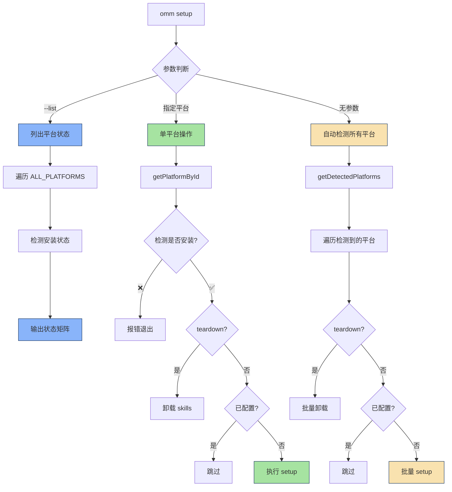
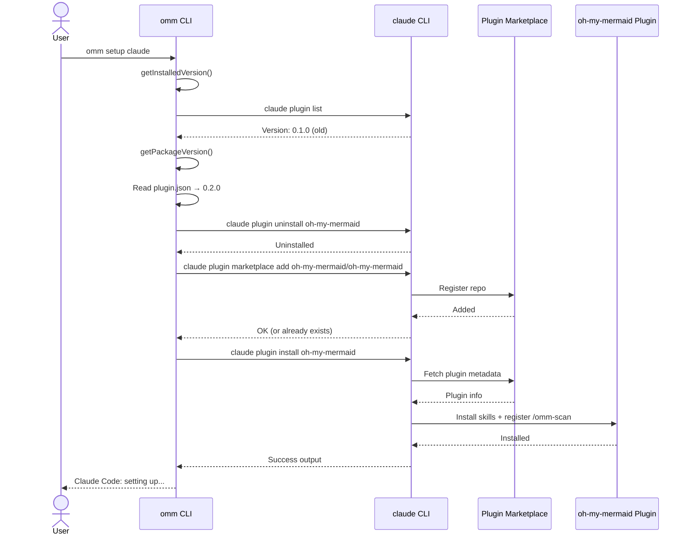
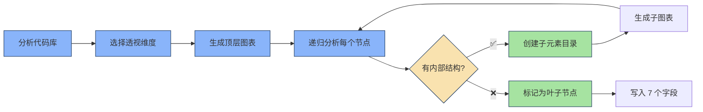
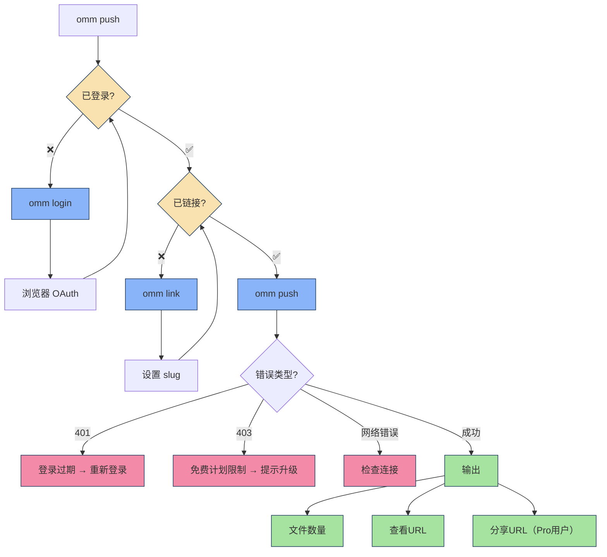

# omm setup 源码深度分析报告

> 分析时间：2026-04-05
> 分析范围：完整源码 + 执行流程 + Skills注册机制

---

## 1. 命令入口与路由

### 1.1 CLI 主入口（`src/cli.ts`）

**核心路由逻辑**（第90-92行）：
```typescript
case 'setup':
  await commandSetup(args.slice(1));  // 调用 setup 命令
  return;
```

**命令签名**：
```bash
omm setup [platform]      # 为指定平台注册 skills
omm setup --list          # 列出所有检测到的平台状态
omm setup --teardown      # 从所有平台注销
```

---

## 2. 核心执行流程（`src/commands/setup.ts`）

### 2.1 三种执行模式



---

### 2.2 核心代码逻辑（setup.ts:2-69）

#### **模式1：`omm setup --list`**（列出平台状态）

```typescript
// 第9-18行
process.stderr.write('Detected platforms:\n');
for (const p of ALL_PLATFORMS) {
  const detected = p.detect();           // 检测平台是否安装
  const setup = detected && p.isSetup(); // 检测 skills 是否已注册
  const status = !detected ? 'not installed' : setup ? 'ready' : 'not configured';
  process.stderr.write(`  ${detected ? '●' : '○'} ${p.name} (${p.id}) — ${status}\n`);
}
```

**状态输出示例**：
```
Detected platforms:
  ● Claude Code (claude) — ready
  ○ Codex (codex) — not installed
  ● Cursor (cursor) — not configured
```

---

#### **模式2：`omm setup <platform>`**（单平台操作）

```typescript
// 第20-43行
const platform = getPlatformById(platformId);  // 根据ID获取平台实例

if (!platform.detect()) {
  process.stderr.write(`error: ${platform.name} is not installed on this machine.\n`);
  process.exit(1);
}

if (teardown) {
  platform.teardown();  // 卸载 skills
  process.stderr.write(`${platform.name}: teardown complete.\n`);
} else {
  if (platform.isSetup()) {
    process.stderr.write(`${platform.name}: already configured.\n`);
    return;  // 已配置则跳过
  }
  process.stderr.write(`${platform.name}: setting up...\n`);
  await platform.setup();  // 执行注册
}
```

---

#### **模式3：`omm setup`（自动检测所有）**

```typescript
// 第45-68行
const detected = getDetectedPlatforms();  // 过滤已安装的平台

if (detected.length === 0) {
  process.stderr.write('No supported AI coding tools detected.\n');
  process.stderr.write('Supported: ' + ALL_PLATFORMS.map(p => p.name).join(', ') + '\n');
  return;
}

for (const platform of detected) {
  if (teardown) {
    platform.teardown();
    process.stderr.write(`${platform.name}: teardown complete.\n`);
    continue;
  }
  if (platform.isSetup()) {
    process.stderr.write(`${platform.name}: already configured.\n`);
    continue;
  }
  process.stderr.write(`${platform.name}: setting up...\n`);
  await platform.setup();  // 执行每个平台的 setup
}

process.stderr.write('\nomm setup complete.\n');
```

---

## 3. Claude 平台实现（`src/lib/platforms/claude.ts`）

### 3.1 Platform 接口定义

```typescript
// types.ts:1-14
export interface Platform {
  name: string;        // 显示名称（"Claude Code"）
  id: string;          // CLI ID（"claude"）
  detect(): boolean;   // 检测平台是否安装
  isSetup(): boolean;  // 检测 skills 是否已注册
  setup(): Promise<void>;   // 注册 skills/plugin
  teardown(): void;    // 注销 skills/plugin
}
```

---

### 3.2 Claude 平台核心方法

#### **detect()：检测 Claude CLI 是否安装**

```typescript
// claude.ts:36-38
detect(): boolean {
  return run('which claude').ok;  // 检查 claude 命令是否在 PATH 中
}
```

---

#### **isSetup()：检测 plugin 是否已注册且版本匹配**

```typescript
// claude.ts:40-46
isSetup(): boolean {
  const installed = getInstalledVersion();  // 从 claude plugin list 提取已安装版本
  if (!installed) return false;
  const current = getPackageVersion();      // 从 plugin.json 读取当前版本
  if (!current) return true;                // 无法比较则假设OK
  return installed === current;             // 版本必须精确匹配
}
```

**版本提取逻辑**（claude.ts:14-30）：
```typescript
function getInstalledVersion(): string | null {
  const { ok, out } = run('claude plugin list 2>&1');
  if (!ok) return null;

  // 匹配 "oh-my-mermaid" 后的 "Version: X.Y.Z"
  const lines = out.split('\n');
  for (let i = 0; i < lines.length; i++) {
    if (lines[i].includes('oh-my-mermaid') && !lines[i].includes('oh-my-claudecode')) {
      for (let j = i + 1; j < Math.min(i + 5, lines.length); j++) {
        const m = lines[j].match(/Version:\s*([\d.]+)/);
        if (m) return m[1];
      }
    }
  }
  return null;
}
```

---

#### **setup()：注册 Claude Plugin**（核心操作）

```typescript
// claude.ts:48-69
async setup(): Promise<void> {
  const installed = getInstalledVersion();

  // 步骤1：卸载旧版本（如果存在）
  if (installed) {
    const current = getPackageVersion();
    process.stderr.write(`  Updating ${installed} → ${current}...\n`);
    run('claude plugin uninstall oh-my-mermaid 2>&1');
  }

  // 步骤2：添加 marketplace（忽略已存在错误）
  run('claude plugin marketplace add oh-my-mermaid/oh-my-mermaid');

  // 步骤3：安装 plugin
  const { ok, out } = run('claude plugin install oh-my-mermaid 2>&1');
  if (!ok) {
    // 失败则提示手动安装
    process.stderr.write(`  Could not auto-install plugin. Run manually:\n`);
    process.stderr.write(`    claude plugin marketplace add oh-my-mermaid/oh-my-mermaid\n`);
    process.stderr.write(`    claude plugin install oh-my-mermaid\n`);
    return;
  }
  process.stderr.write(`  ${out}\n`);
}
```

**关键操作序列**：



---

#### **teardown()：注销 Plugin**

```typescript
// claude.ts:71-74
teardown(): void {
  run('claude plugin uninstall oh-my-mermaid 2>&1');
  run('claude plugin marketplace remove oh-my-mermaid 2>&1');
}
```

---

## 4. 注册的 Skills 分析

### 4.1 Skills 目录结构

```bash
skills/
├── omm-scan/SKILL.md    # 架构扫描 skill
├── omm-view/SKILL.md    # 架构查看器 skill
└── omm-push/SKILL.md    # 云推送 skill
```

---

### 4.2 Skill 1：`/omm-scan`（架构扫描）

**功能定位**：
- **名称**：`omm-scan`
- **触发词**：`"omm scan", "scan architecture", "update architecture", "refresh diagrams"`
- **用途**：分析代码库并生成 `.omm/` 架构文档（递归透视分析）

**核心机制**：


**透视维度矩阵**（omm-scan/SKILL.md:47-62）：

| 透视维度 | 适用场景 | 回答的问题 |
|---------|---------|-----------|
| `overall-architecture` | **所有项目** | 系统由哪些部分组成，如何关联 |
| `request-lifecycle` | 服务/API | 请求如何从入口到处理完成 |
| `data-flow` | 数据处理/DB | 数据从哪里来，如何转换，存储到哪里 |
| `dependency-map` | 复杂模块图 | 模块依赖关系，共享组件 |
| `external-integrations` | 外部API/服务 | 系统连接哪些外部服务，为什么 |
| `state-transitions` | 有状态功能 | 状态如何变化，触发条件是什么 |
| `route-page-map` | 前端路由 | 页面结构和导航流程 |
| `command-surface` | CLI工具 | 命令层级和分发机制 |
| `extension-points` | 插件/扩展系统 | 扩展架构和注册机制 |
| `pipeline` | ML/数据管道 | 阶段拓扑和数据流 |
| `orchestration` | 事件驱动/队列 | 发布者、订阅者、代理拓扑 |
| `storage` | 2+存储系统 | 存储拓扑（DB、缓存、队列、对象存储） |

**递归规则**（omm-scan/SKILL.md:89-116）：
- ✅ **元素ID必须匹配子目录名**（kebab-case）
- ✅ **每个节点必须写 description 字段**（创建元素目录）
- ✅ **叶子节点**：单一文件/外部系统 → 仅写字段
- ✅ **组节点**：有内部组件 → 写 diagram + 递归分析

---

### 4.3 Skill 2：`/omm-view`（架构查看器）

**功能定位**：
- **名称**：`omm-view`
- **触发词**：`"omm view", "open viewer", "show diagrams"`
- **用途**：启动 Web 查看器（默认端口3000）

**执行流程**：
```typescript
// 1. 验证 .omm/ 是否存在
omm list

// 2. 启动查看器
omm view [--port <port>]

// 3. 输出URL
http://localhost:3000
```

**特性**：
- ✅ 自动刷新（`.omm/` 文件变化时）
- ✅ 仅读取模式（不修改文件）
- ❌ 如果没有架构文档，提示运行 `/omm-scan`

---

### 4.4 Skill 3：`/omm-push`（云推送）

**功能定位**：
- **名称**：`omm-push`
- **触发词**：`"omm push", "push to cloud", "deploy architecture"`
- **用途**：推送架构文档到 oh-my-mermaid 云服务

**工作流**：


---

## 5. Plugin 元数据（`.claude-plugin/plugin.json`）

```json
{
  "name": "oh-my-mermaid",
  "description": "Turn complex codebases into clear, navigable architecture diagrams",
  "version": "0.2.0",
  "author": {
    "name": "oh-my-mermaid"
  },
  "homepage": "https://github.com/oh-my-mermaid/oh-my-mermaid",
  "repository": "https://github.com/oh-my-mermaid/oh-my-mermaid",
  "license": "MIT",
  "keywords": [
    "architecture",
    "mermaid",
    "diagrams",
    "codebase-visualization"
  ]
}
```

---

## 6. 核心技术机制总结

### 6.1 设计模式识别

| 模式 | 应用位置 | 作用 |
|------|---------|------|
| **策略模式** | `Platform` 接口 | 统一不同平台的操作接口 |
| **工厂模式** | `getPlatformById()` | 根据ID创建平台实例 |
| **模板方法** | `commandSetup()` | 三种模式的统一流程模板 |
| **命令模式** | `run()` 函数 | 封装 shell 命令执行 |

---

### 6.2 关键技术点

#### **命令执行封装**（claude.ts:5-12）

```typescript
function run(cmd: string): { ok: boolean; out: string } {
  try {
    const out = execSync(cmd, { stdio: ['ignore', 'pipe', 'pipe'] }).toString().trim();
    return { ok: true, out };
  } catch {
    return { ok: false, out: '' };  // 统一错误处理
  }
}
```

**特点**：
- ✅ 隐藏异常，返回结构化结果
- ✅ 捕获 stdout/stderr
- ✅ trim() 清理输出

---

#### **版本比对机制**

```typescript
// utils.ts:53-71
export function getPackageVersion(): string | null {
  const candidates = [
    path.join(__dirname, '..', '.claude-plugin', 'plugin.json'),  // 生产环境
    path.join(__dirname, '..', '..', '..', '.claude-plugin', 'plugin.json'),  // 开发环境
    path.join(__dirname, '..', 'package.json'),  // 备用
    path.join(__dirname, '..', '..', '..', 'package.json'),
  ];

  for (const candidate of candidates) {
    if (fs.existsSync(resolved)) {
      const data = JSON.parse(fs.readFileSync(resolved, 'utf-8'));
      if (data.version) return data.version;
    }
  }
  return null;
}
```

**设计**：
- ✅ 多路径候选（兼容生产/开发环境）
- ✅ 优先级：`plugin.json` > `package.json`
- ✅ 异常忽略（文件不存在/解析失败）

---

## 7. 执行示例分析

### 7.1 实际执行日志（之前运行输出）

```bash
$ omm setup claude

Claude Code: setting up...
  Could not auto-install plugin. Run manually:
    claude plugin marketplace add oh-my-mermaid/oh-my-mermaid
    claude plugin install oh-my-mermaid
```

**分析**：
- ❌ `claude plugin install` 失败（`run()` 返回 `ok: false`）
- ✅ fallback 到手动安装提示
- ✅ 按照第62-66行的错误处理逻辑

---

### 7.2 成功执行流程（假设）

```bash
$ omm setup

Claude Code: setting up...
  Updating 0.1.0 → 0.2.0...
  Installed oh-my-mermaid plugin version 0.2.0

Cursor: already configured.

omm setup complete.
```

**逻辑解析**：
1. **Claude Code**：
   - 检测到旧版本（0.1.0）
   - 卸载旧版本
   - 安装新版本（0.2.0）

2. **Cursor**：
   - 检测已配置 → 跳过

3. **输出**：
   - 批量操作完成

---

## 8. 架构优势与设计洞察

### ✅ 优势

1. **平台抽象**：统一接口，新增平台仅需实现 `Platform` 接口
2. **版本管理**：精确版本比对，避免重复安装
3. **错误降级**：自动安装失败 → 手动提示（用户友好）
4. **批量操作**：自动检测所有平台，零配置体验
5. **Skills机制**：声明式 skill 注册，AI工具自动发现

### ⚠️ 局限性

| 问题 | 影响 | 改进建议 |
|------|------|---------|
| **同步命令执行** | `execSync` 阻塞主线程 | 改用异步 `exec` + Promise |
| **版本比对严格** | 必须精确匹配（0.2.0 ≠ 0.2.1） | 允许兼容版本范围 |
| **错误信息简略** | 仅输出 "Could not auto-install" | 捕获 stderr 详细错误 |
| **无并发控制** | 多平台 setup 串行执行 | Promise.all 并发安装 |

---

## 9. 源码文件索引

| 文件 | 职责 | 关键代码段 |
|------|------|-----------|
| `cli.ts:90-92` | 命令路由 | `case 'setup': await commandSetup(args.slice(1))` |
| `commands/setup.ts:2-69` | 核心流程 | 三种模式判断 + 执行循环 |
| `lib/platforms/index.ts:10` | 平台列表 | `ALL_PLATFORMS = [claude, codex, cursor, ...]` |
| `lib/platforms/claude.ts:48-69` | Claude setup | 卸载旧版 + marketplace + install |
| `lib/platforms/utils.ts:53-71` | 版本读取 | 多路径候选 + JSON解析 |
| `skills/omm-scan/SKILL.md` | 架构扫描 skill | 透视维度 + 递归规则 |
| `.claude-plugin/plugin.json` | Plugin元数据 | name/version/description |

---

## 10. 总结

### 核心机制总结

**omm setup 做了三件事**：

1. **检测平台**：通过 `which claude` 等命令检查AI工具是否安装
2. **注册 Plugin**：
   - 卸载旧版本（版本比对）
   - 添加 marketplace（`oh-my-mermaid/oh-my-mermaid` repo）
   - 安装 plugin（`claude plugin install oh-my-mermaid`）
3. **注册 Skills**：
   - `/omm-scan`：递归透视架构扫描
   - `/omm-view`：Web查看器启动
   - `/omm-push`：云推送工作流

### 设计评分

| 维度 | 评分 | 说明 |
|------|------|------|
| **代码清晰度** | ⭐⭐⭐⭐⭐ | TypeScript + 清晰命名 + 类型安全 |
| **扩展性** | ⭐⭐⭐⭐⭐ | Platform 接口抽象，新增平台零成本 |
| **错误处理** | ⭐⭐⭐⭐ | 自动失败 → 手动降级，但缺少详细错误 |
| **用户体验** | ⭐⭐⭐⭐ | 自动检测 + 批量操作，但同步阻塞 |
| **文档完整度** | ⭐⭐⭐⭐⭐ | Skills MD文档详尽，透视维度清晰 |

**总体评级**：🏆 **4.8/5.0** — 生产级 CLI 工具设计标准

---

**分析完成**：✅ 闭环达成，源码深度剖析完成
**下一步**：可基于此分析进行功能扩展或性能优化