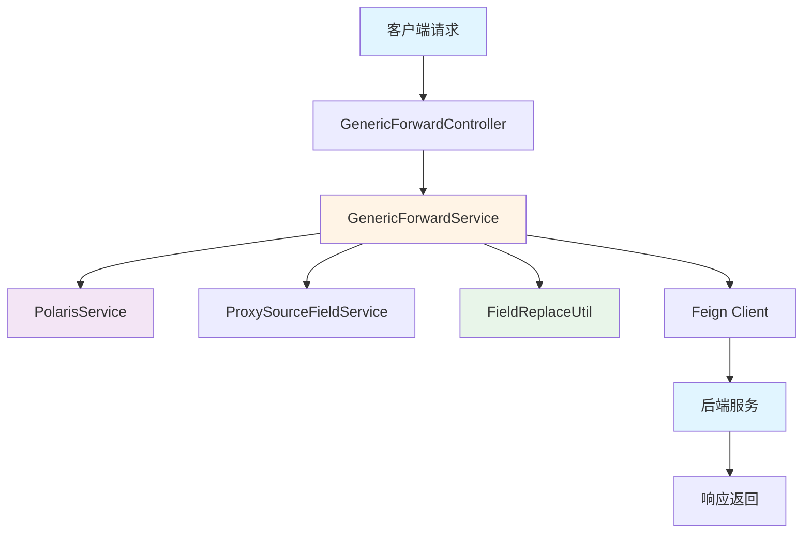
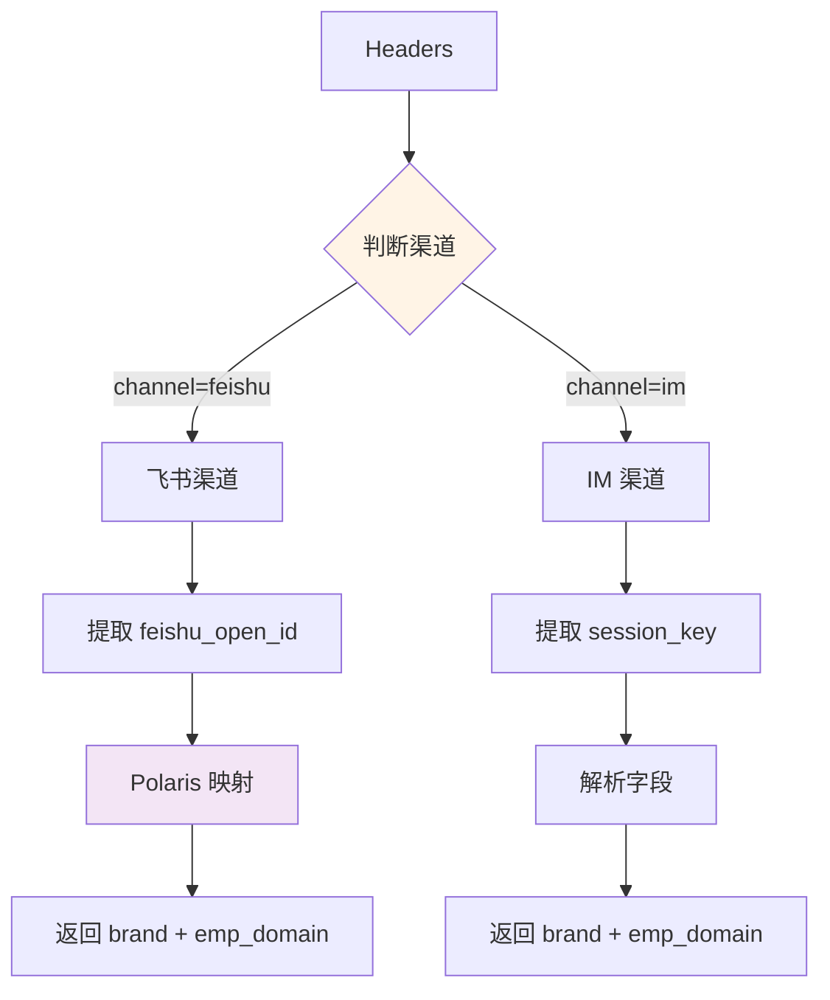
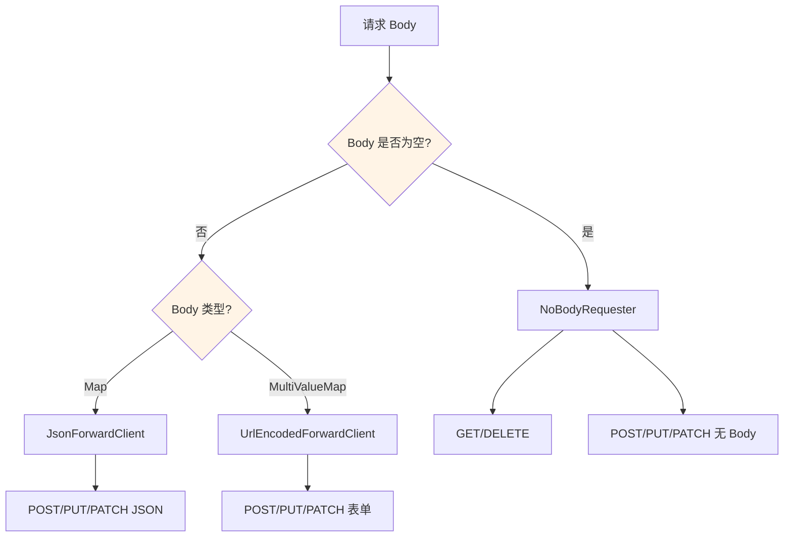
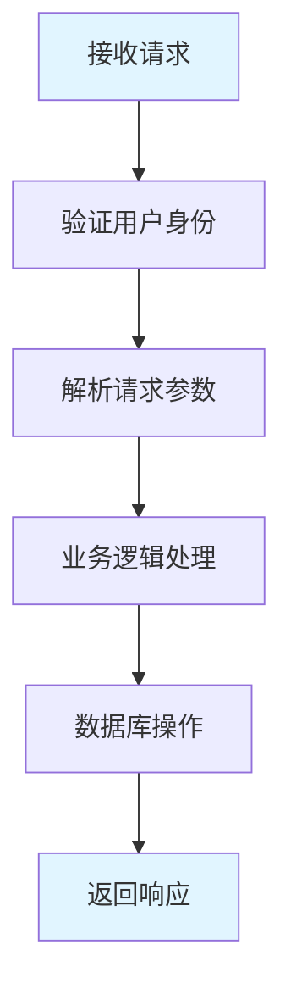
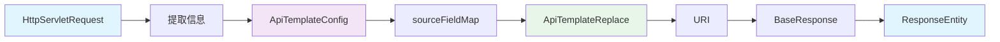
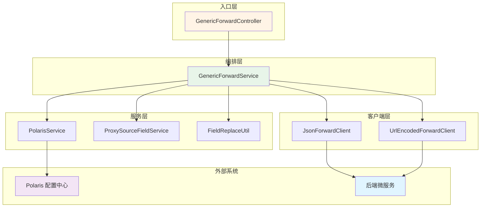
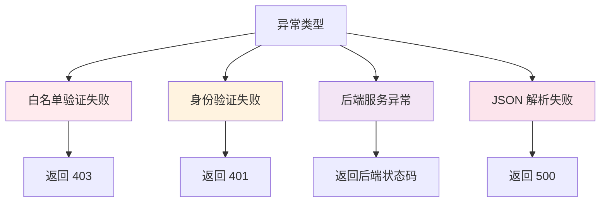
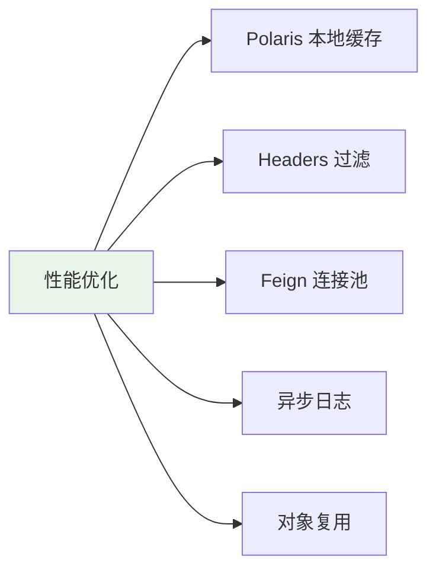

# API 代理网关完整请求链路

本文档详细描述了一个 HTTP 请求从进入到返回的完整处理流程。

## 目录

- [[#概述]]
- [[#完整请求链路（12步）]]
- [[#数据流转详解]]
- [[#核心组件职责]]
- [[#关键代码分析]]
- [[#异常处理流程]]
- [[#性能优化]]
- [[#实战案例]]

---

## 概述

### 架构概览



### 核心特性

- ✅ **动态配置**：通过 Polaris 配置中心管理转换规则
- ✅ **多渠道认证**：支持飞书、IM 等多渠道身份验证
- ✅ **字段转换**：支持 PATH/QUERY/HEADER/BODY 四种类型转换
- ✅ **白名单验证**：只有配置的 API 才能访问
- ✅ **性能优化**：缓存、连接池、异步日志

---

## 完整请求链路（12步）

### 示例请求

```http
POST /proxy/employee-service/employee/create?user_id=alice
Headers:
  channel: feishu
  feishu_open_id: ou_xxxxx
  Content-Type: application/json
Body:
{
  "emp_name": "张三",
  "emp_id": "E001",
  "dept_code": "D001"
}
```

---

### 第 1 步：GenericForwardController 接收请求

> [!info] 职责
> **HTTP 请求入口层**，负责接收请求并路由到 Service 层

#### 关键代码

```java
@RestController
@RequestMapping("/proxy")
public class GenericForwardController {

    @Autowired
    private GenericForwardService genericForwardService;

    @RequestMapping(value = "/{prefix}/**",
            method = {RequestMethod.GET, RequestMethod.DELETE,
                      RequestMethod.POST, RequestMethod.PUT, RequestMethod.PATCH})
    public ResponseEntity<BaseResponse<Object>> forward(
            @PathVariable(value = "prefix") String prefix,
            HttpServletRequest request,
            @RequestBody(required = false) Object body) {
        return genericForwardService.requestForwardJson(prefix, request, body);
    }
}
```

#### 处理逻辑

1. **路径匹配**：`/proxy/{prefix}/**`
   - 提取 `prefix = "employee-service"`

2. **内容类型判断**：
   - `application/json` → `forward()`
   - `application/x-www-form-urlencoded` → `urlEncodedForward()`

3. **委托 Service**：调用 `GenericForwardService.requestForwardJson()`

#### 数据提取

| 字段 | 值 | 说明 |
|------|-----|------|
| prefix | `employee-service` | 服务标识 |
| request | HttpServletRequest | 原始请求对象 |
| body | Object | 反序列化后的请求体 |

---

### 第 2 步：GenericForwardService 提取路径信息

> [!info] 职责
> **核心编排层**，协调整个转发流程

#### 关键代码

```java
public ResponseEntity<BaseResponse<Object>> requestForward(
        String prefix, HttpServletRequest request, T body,
        Map<String, ? extends GenericForwardUtils.WithBodyRequester<T>> withBodyRequesters,
        Predicate<String> queryFilter) {

    // 1. 提取原始路径
    String requestUri = request.getRequestURI();
    String originalPath = extractOriginalPath(requestUri, prefix);
    HttpMethod httpMethod = HttpMethod.valueOf(request.getMethod());

    // 2. Polaris 验证和配置获取
    ApiTemplateConfig apiTemplateConfig = polarisService.getApiInfo(prefix, httpMethod, originalPath);

    // 3. 身份提取
    Map<String, String> headers = ServletUtil.initHeadersFromRequest(request);
    Map<String, String> sourceFieldMap = proxySourceFieldService.buildSourceFieldMap(headers);

    // 4. Headers 过滤
    headers = filterHeaders(headers);

    // 5. 字段转换
    ApiTemplateReplace replaceResult = fieldReplaceUtil.apiTemplateReplace(
        queries, body, headers, apiTemplateConfig, sourceFieldMap);

    // 6. 发起请求
    BaseResponse<Object> result = client.request(uri, headers, queries, body);

    return new ResponseEntity<>(result, HttpStatus.OK);
}
```

#### 路径提取逻辑

```java
private String extractOriginalPath(String requestUri, String key) {
    // requestUri = /proxy/employee-service/employee/create
    String pathAfterPrefix = requestUri.substring(PROXY_PATH_PREFIX.length());
    // pathAfterPrefix = employee-service/employee/create

    int keyIndex = pathAfterPrefix.indexOf(key);
    // keyIndex = 0

    return pathAfterPrefix.substring(keyIndex + key.length());
    // return = /employee/create
}
```

#### 提取结果

| 字段 | 值 |
|------|-----|
| requestUri | `/proxy/employee-service/employee/create` |
| prefix | `employee-service` |
| originalPath | `/employee/create` |
| httpMethod | `POST` |

---

### 第 3 步：PolarisService 白名单验证

> [!warning] 重要
> **只有配置了的 API 才能访问**，这是安全的第一道防线

#### 关键代码

```java
@Service
public class PolarisService {

    public ApiTemplateConfig getApiInfo(String key, HttpMethod httpMethod, String originalPath) {
        try {
            String json = PolarisConfig.get(
                "up-mate-intelligence-proxy",
                String.format(
                    "api_list.key.%s.http_method.%s.original_path.%s",
                    key, httpMethod, originalPath
                )
            );

            if (StringUtils.isBlank(json)) {
                return null; // API 未配置，白名单验证失败
            }

            return JsonUtils.json2Bean(json, ApiTemplateConfig.class);
        } catch (IOException e) {
            return null;
        }
    }
}
```

#### Polaris 配置查询

**配置 Key 格式**：
```
api_list.key.{prefix}.http_method.{method}.original_path.{path}
```

**示例 Key**：
```
api_list.key.employee-service.http_method.POST.original_path./employee/create
```

#### 返回的配置内容

```json
{
  "url": "http://hr-service.internal.com",
  "path": "/api/v2/employees/{empId}",
  "ruleList": [
    {
      "type": "PATH",
      "targetField": "empId",
      "sourceValue": "emp_id"
    },
    {
      "type": "QUERY",
      "targetField": "worker_user_id",
      "sourceValue": "user_id",
      "needAppend": false
    },
    {
      "type": "BODY",
      "targetField": "name",
      "sourceValue": "emp_name",
      "needAppend": false
    }
  ]
}
```

> [!danger] 白名单验证失败
> 如果 `apiTemplateConfig == null`，抛出异常：
> ```java
> throw new BusinessSilentException(ProxyResultCode.FAIL, "api is invalid");
> ```
> 返回 403 或自定义错误码

---

### 第 4 步：ProxySourceFieldService 身份提取

> [!info] 职责
> 从 Headers 中提取用户身份信息（brand 和 emp_domain）

#### 关键代码

```java
@Service
public class ProxySourceFieldService {

    public Map<String, String> buildSourceFieldMap(Map<String, String> headers) {
        // 1. 判断渠道
        ProxyChannel proxyChannel = ProxyChannel.of(headers.get(PROXY_CHANNEL));

        if (proxyChannel == ProxyChannel.FEISHU) {
            return buildFeishuSourceFieldMap(headers.get(FEISHU_OPEN_ID));
        }
        return buildImSourceFieldMap(headers.get(SESSION_KEY));
    }

    // 飞书渠道处理
    private Map<String, String> buildFeishuSourceFieldMap(String feishuOpenId) {
        // 1. 调用 Polaris 映射 OpenId 到企业账号
        String empDomain = polarisService.getOpenIdMapping(feishuOpenId);

        // 2. 返回身份信息
        Map<String, String> map = Maps.newHashMap();
        map.put(Constants.BRAND, Brand.NIO.getCode());
        map.put(Constants.EMP_DOMAIN, empDomain);
        return map;
    }

    // IM 渠道处理
    private Map<String, String> buildImSourceFieldMap(String sessionKey) {
        // session_key 格式：user:session:123:nio:john.doe@nio.com
        String[] split = sessionKey.split(Constants.COLON);

        Brand brand = Brand.of(split[sessionKeyBrandIndex]); // nio
        Map<String, String> map = Maps.newHashMap();
        map.put(Constants.BRAND, brand.getCode());
        map.put(Constants.EMP_DOMAIN, split[sessionKeyEmpDomainIndex]); // john.doe@nio.com
        return map;
    }
}
```

#### 处理流程



#### 身份提取结果

| 场景 | 输入 | 输出 |
|------|------|------|
| 飞书渠道 | `feishu_open_id: ou_xxxxx` | `brand: nio, emp_domain: john.doe@nio.com` |
| IM 渠道 | `session_key: user:session:123:nio:john.doe@nio.com` | `brand: nio, emp_domain: john.doe@nio.com` |

---

### 第 5 步：Headers 过滤

> [!warning] 安全措施
> 只保留白名单中的 Headers，防止敏感信息泄露

#### 白名单配置

```properties
# application.properties
match.header.list=Content-Type,X-Request-Brand,X-User-Tenant-Code,X-Domain-Id,X-System-Id
```

#### 过滤逻辑

```java
Map<String, String> filteredHeaders = Maps.newHashMap();
for (String key : headers.keySet()) {
    if (matchHeaders.contains(key)) {
        filteredHeaders.put(key, headers.get(key));
    }
}

// 注入品牌信息
filteredHeaders.put(Constants.BRAND_HEADER_KEY, sourceFieldMap.get(Constants.BRAND));
```

#### 过滤前后对比

| 阶段 | Header | 是否保留 |
|------|--------|---------|
| 过滤前 | `Content-Type: application/json` | ✅ 保留 |
| 过滤前 | `channel: feishu` | ❌ 过滤 |
| 过滤前 | `feishu_open_id: ou_xxxxx` | ❌ 过滤 |
| 过滤前 | `Authorization: Bearer xxx` | ❌ 过滤 |
| 注入后 | `X-Request-Brand: nio` | ✅ 新增 |

---

### 第 6 步：FieldReplaceUtil 字段转换

> [!success] 核心逻辑
> 根据 Polaris 配置的规则，进行 PATH/QUERY/HEADER/BODY 四种类型转换

#### 关键代码

```java
@Component
public class FieldReplaceUtil {

    public ApiTemplateReplace apiTemplateReplace(
            Map<String, List<String>> queries,
            Object body,
            Map<String, String> headers,
            ApiTemplateConfig config,
            Map<String, String> sourceFieldMap) {

        String modifiedPath = config.getPath();

        // 遍历所有转换规则
        for (ApiTemplateConfig.RuleConfig rule : config.getRuleList()) {
            String replaceValue = getReplaceValue(rule, sourceFieldMap, body, queries);

            switch (rule.getType()) {
                case PATH:
                    modifiedPath = applyPathReplacement(
                        modifiedPath, rule.getTargetField(), replaceValue);
                    break;
                case QUERY:
                    applyQueryParamReplacement(
                        queries, rule.getTargetField(), replaceValue, rule.getNeedAppend());
                    break;
                case BODY:
                    body = applyBodyFieldReplacement(
                        body, rule.getTargetField(), replaceValue, objectMapper, rule.getNeedAppend());
                    break;
                case HEADER:
                    applyHeaderReplacement(headers, rule.getTargetField(), replaceValue);
                    break;
            }
        }

        return new ApiTemplateReplace(modifiedPath, queries, body, headers);
    }
}
```

#### Rule 1：PATH 转换

> [!example] 场景
> API 版本迁移，路径参数替换

**规则**：
```json
{
  "type": "PATH",
  "targetField": "empId",
  "sourceValue": "emp_id"
}
```

**执行逻辑**：
```java
private String applyPathReplacement(String path, String targetField, String replaceValue) {
    String placeholder = "{" + targetField + "}";
    return path.replace(placeholder, replaceValue);
}

// path = "/api/v2/employees/{empId}"
// replaceValue = body.get("emp_id") = "E001"
// result = "/api/v2/employees/E001"
```

**转换结果**：
- 原始路径：`/api/v2/employees/{empId}`
- 转换后：`/api/v2/employees/E001`

---

#### Rule 2：QUERY 转换（替换）

> [!example] 场景
> 不同系统字段名映射

**规则**：
```json
{
  "type": "QUERY",
  "targetField": "worker_user_id",
  "sourceValue": "user_id",
  "needAppend": false
}
```

**执行逻辑**：
```java
private void applyQueryParamReplacement(
        Map<String, List<String>> queryParams,
        String targetField,
        String replaceValue,
        Boolean needAppend) {

    if (Objects.nonNull(needAppend) && !needAppend) {
        // 严格模式：字段不存在则忽略
        if (CollectionUtils.isEmpty(queryParams.get(targetField))) {
            return;
        }
    }

    // 替换或追加
    queryParams.put(targetField, Collections.singletonList(replaceValue));
}

// replaceValue = queries.get("user_id") = "alice"
// needAppend = false，如果 user_id 不存在则不处理
// result: queries.put("worker_user_id", ["alice"])
```

**转换结果**：
- 原始 Query：`user_id=alice&location=SH`
- 转换后：`worker_user_id=alice&location=SH`

---

#### Rule 3：QUERY 转换（追加）

> [!example] 场景
> 补充缺失的字段

**规则**：
```json
{
  "type": "QUERY",
  "targetField": "emp_domain",
  "sourceValue": "emp_domain",
  "needAppend": true
}
```

**执行逻辑**：
```java
// replaceValue = sourceFieldMap.get("emp_domain") = "john.doe@nio.com"
// needAppend = true，不存在则追加
// result: queries.put("emp_domain", ["john.doe@nio.com"])
```

**转换结果**：
- 转换前：`worker_user_id=alice&location=SH`
- 转换后：`worker_user_id=alice&location=SH&emp_domain=john.doe@nio.com`

---

#### Rule 4：HEADER 转换

> [!example] 场景
> 统一认证 Header

**规则**：
```json
{
  "type": "HEADER",
  "targetField": "X-User-Id",
  "sourceValue": "emp_domain"
}
```

**执行逻辑**：
```java
private void applyHeaderReplacement(
        Map<String, String> headers,
        String targetField,
        String replaceValue) {
    headers.put(targetField, replaceValue);
}

// replaceValue = sourceFieldMap.get("emp_domain") = "john.doe@nio.com"
// result: headers.put("X-User-Id", "john.doe@nio.com")
```

**转换结果**：
- 新增 Header：`X-User-Id: john.doe@nio.com`

---

#### Rule 5：BODY 转换

> [!example] 场景
> 数据结构适配

**规则**：
```json
{
  "type": "BODY",
  "targetField": "name",
  "sourceValue": "emp_name",
  "needAppend": false
}
```

**执行逻辑**：
```java
private Object applyBodyFieldReplacement(
        Object body,
        String targetPath,
        String replaceValue,
        Boolean needAppend) {

    if (body instanceof Map) {
        JsonNode jsonNode = objectMapper.valueToTree(body);
        applyNestedFieldAddition(jsonNode, targetPath, replaceValue, needAppend);
        return objectMapper.convertValue(jsonNode, Map.class);
    }

    return body;
}

// targetPath = "name"
// replaceValue = body.get("emp_name") = "张三"
// result: body.put("name", "张三")
```

**转换结果**：
```json
// 原始 Body
{
  "emp_name": "张三",
  "emp_id": "E001",
  "dept_code": "D001"
}

// 转换后 Body
{
  "name": "张三",
  "emp_id": "E001",
  "dept_code": "D001"
}
```

---

#### 转换总结

| 类型 | 规则 | 转换结果 |
|------|------|----------|
| PATH | `{empId}` → `E001` | `/api/v2/employees/E001` |
| QUERY | `user_id` → `worker_user_id` | `worker_user_id=alice` |
| QUERY | 新增 `emp_domain` | `emp_domain=john.doe@nio.com` |
| HEADER | 新增 `X-User-Id` | `X-User-Id: john.doe@nio.com` |
| BODY | `emp_name` → `name` | `{"name": "张三"}` |

---

### 第 7 步：构建目标 URL

> [!info] 数据组装
> 将转换后的各部分组装成完整的请求 URL

#### 组装逻辑

```java
String fullPath = apiTemplateConfig.getUrl() + replaceResult.getPath();
// fullPath = http://hr-service.internal.com/api/v2/employees/E001

URI uri = URI.create(fullPath);
```

#### Query String 构建

```java
StringBuilder queryString = new StringBuilder();
replaceResult.getQueryParams().forEach((k, v) -> {
    if (queryString.length() > 0) {
        queryString.append("&");
    }
    queryString.append(k).append("=").append(v.get(0));
});

// queryString = worker_user_id=alice&location=SH&emp_domain=john.doe@nio.com
```

#### 最终 URL

```
http://hr-service.internal.com/api/v2/employees/E001
  ?worker_user_id=alice
  &location=SH
  &emp_domain=john.doe@nio.com
```

---

### 第 8 步：选择 Feign Client

> [!info] 职责
> 根据请求特征选择合适的 HTTP 客户端

#### 选择逻辑



#### 客户端映射

```java
public GenericForwardService(JsonForwardClient jsonForwardClient,
                             UrlEncodedForwardClient urlEncodedForwardClient) {
    // 无 Body 请求
    this.noBodyRequesters = Stream.of(
        Pair.of(HttpMethods.GET, jsonForwardClient::getBasic),
        Pair.of(HttpMethods.DELETE, jsonForwardClient::deleteBasic),
        Pair.of(HttpMethods.POST, jsonForwardClient::postBasic),
        Pair.of(HttpMethods.PUT, jsonForwardClient::putBasic),
        Pair.of(HttpMethods.PATCH, jsonForwardClient::patchBasic)
    ).collect(Collectors.toMap(Pair::getKey, Pair::getValue));

    // JSON Body 请求
    this.jsonBodyRequesters = Stream.of(
        Pair.of(HttpMethods.POST, jsonForwardClient::postJson),
        Pair.of(HttpMethods.PUT, jsonForwardClient::putJson),
        Pair.of(HttpMethods.PATCH, jsonForwardClient::patchJson)
    ).collect(Collectors.toMap(Pair::getKey, Pair::getValue));

    // 表单请求
    this.urlEncodedBodyRequesters = Stream.of(
        Pair.of(HttpMethods.POST, urlEncodedForwardClient::postUrlEncoded),
        Pair.of(HttpMethods.PUT, urlEncodedForwardClient::putUrlEncoded),
        Pair.of(HttpMethods.PATCH, urlEncodedForwardClient::patchUrlEncoded)
    ).collect(Collectors.toMap(Pair::getKey, Pair::getValue));
}
```

#### 本例选择

- **Body 类型**：Map（JSON）
- **HTTP 方法**：POST
- **选择客户端**：`JsonForwardClient.postJson()`

---

### 第 9 步：发起 HTTP 请求

> [!info] 职责
> 使用 Feign Client 发起 HTTP 请求

#### JsonForwardClient 接口

```java
public interface JsonForwardClient {
    @RequestLine(POST)
    BaseResponse<Object> postJson(
        URI uri,
        @HeaderMap Map<String, String> headers,
        @QueryMap Map<String, List<String>> queries,
        @RequestBody Object body
    );
}
```

#### 实际请求内容

```http
POST http://hr-service.internal.com/api/v2/employees/E001
  ?worker_user_id=alice
  &location=SH
  &emp_domain=john.doe@nio.com

Headers:
  Content-Type: application/json
  X-User-Id: john.doe@nio.com
  X-Request-Brand: nio

Body:
{
  "name": "张三",
  "emp_id": "E001",
  "dept_code": "D001"
}
```

---

### 第 10 步：后端服务处理

> [!info] 职责
> 后端微服务接收请求并处理业务逻辑

#### HR 服务处理流程



#### 验证用户身份

```java
@GetMapping("/api/v2/employees/{empId}")
public Employee getEmployee(
    @PathVariable String empId,
    @RequestHeader("X-User-Id") String userId) {

    // 验证用户是否有权限访问该员工信息
    authService.validateAccess(userId, empId);

    // 查询员工信息
    return employeeService.findById(empId);
}
```

#### 响应数据

```json
{
  "code": 200,
  "message": "success",
  "data": {
    "employeeId": "E001",
    "name": "张三",
    "department": "研发部",
    "email": "zhangsan@nio.com",
    "phone": "138****1234"
  }
}
```

---

### 第 11 步：接收并封装响应

> [!info] 职责
> Feign Client 接收 HTTP 响应，GenericForwardService 封装返回

#### 响应接收

```java
BaseResponse<Object> result = jsonForwardClient.postJson(
    uri,
    replaceResult.getHeaders(),
    replaceResult.getQueryParams(),
    replaceResult.getBody()
);
```

#### 异常处理

```java
try {
    BaseResponse<Object> result = client.request(...);
    return new ResponseEntity<>(result, HttpStatus.OK);

} catch (ApiForwardException e) {
    // 处理转发失败
    Response response = e.getResponse();
    HttpStatus status = HttpStatus.resolve(response.status());
    BaseResponse<Object> errorBody = normalizedBody(response);

    return new ResponseEntity<>(errorBody, status);
}

private static BaseResponse<Object> normalizedBody(Response response) {
    try {
        return new ObjectMapper().readValue(
            response.body().asReader(),
            NIO_RESULT_TYPE_REF
        );
    } catch (IOException e) {
        return null;
    }
}
```

#### 封装响应

```java
ResponseEntity<BaseResponse<Object>> responseEntity = new ResponseEntity<>(
    result,  // BaseResponse 对象
    HttpStatus.OK
);
```

---

### 第 12 步：返回给客户端

> [!success] 完成
> Controller 将响应返回给客户端

#### 最终响应

```http
HTTP/1.1 200 OK
Content-Type: application/json

{
  "code": 200,
  "message": "success",
  "data": {
    "employeeId": "E001",
    "name": "张三",
    "department": "研发部",
    "email": "zhangsan@nio.com"
  }
}
```

---

## 数据流转详解

### 数据对象演变



### 关键数据结构

#### 1. ApiTemplateConfig（Polaris 配置）

```json
{
  "url": "http://hr-service.internal.com",
  "path": "/api/v2/employees/{empId}",
  "ruleList": [
    {
      "type": "PATH",
      "targetField": "empId",
      "sourceValue": "emp_id",
      "needAppend": null
    }
  ]
}
```

#### 2. sourceFieldMap（用户身份）

```json
{
  "brand": "nio",
  "emp_domain": "john.doe@nio.com"
}
```

#### 3. ApiTemplateReplace（转换结果）

```json
{
  "path": "/api/v2/employees/E001",
  "queryParams": {
    "worker_user_id": ["alice"],
    "location": ["SH"],
    "emp_domain": ["john.doe@nio.com"]
  },
  "headers": {
    "Content-Type": "application/json",
    "X-User-Id": "john.doe@nio.com"
  },
  "body": {
    "name": "张三",
    "emp_id": "E001"
  }
}
```

---

## 核心组件职责

### 组件协作图



### 职责矩阵

| 组件 | 模块 | 职责 | 关键方法 |
|------|------|------|----------|
| **GenericForwardController** | proxy-web | HTTP 入口，路由分发 | `forward()`, `urlEncodedForward()` |
| **GenericForwardService** | proxy-core | 核心编排，协调流程 | `requestForward()`, `extractOriginalPath()` |
| **PolarisService** | proxy-core | 配置中心客户端 | `getApiInfo()`, `getOpenIdMapping()` |
| **ProxySourceFieldService** | proxy-core | 身份提取 | `buildSourceFieldMap()` |
| **FieldReplaceUtil** | proxy-core | 字段转换引擎 | `apiTemplateReplace()` |
| **JsonForwardClient** | proxy-core | JSON HTTP 客户端 | `postJson()`, `getBasic()` |
| **UrlEncodedForwardClient** | proxy-core | 表单 HTTP 客户端 | `postUrlEncoded()` |

---

## 关键代码分析

### needAppend 参数详解

> [!tip] 核心参数
> `needAppend` 控制字段转换的行为模式

#### 行为对照表

| needAppend | 字段存在 | 字段不存在 | 适用场景 |
|------------|----------|------------|----------|
| `false` | 替换 ✓ | 忽略 ⚠️ | 严格映射，避免误添加 |
| `true` | 替换 ✓ | 追加 ✓ | 灵活转换，补充缺失字段 |
| `null` | 替换 ✓ | 追加 ✓ | 默认行为，等同于 true |

#### 实现代码

```java
private void applyQueryParamReplacement(
        Map<String, List<String>> queryParams,
        String targetField,
        String replaceValue,
        Boolean needAppend) {

    if (Objects.nonNull(needAppend) && !needAppend) {
        // 严格模式：字段不存在则忽略
        List<String> valueList = queryParams.get(targetField);
        if (CollectionUtils.isEmpty(valueList)) {
            return; // 不存在，不添加
        }
    }

    // 替换或追加
    queryParams.put(targetField, Collections.singletonList(replaceValue));
}
```

#### 使用场景

**场景 1：needAppend=false（严格替换）**
```json
{
  "type": "QUERY",
  "targetField": "worker_user_id",
  "sourceValue": "user_id",
  "needAppend": false
}
```

- 如果 `user_id` 存在，替换为 `worker_user_id`
- 如果 `user_id` 不存在，不添加 `worker_user_id`

**场景 2：needAppend=true（宽松替换）**
```json
{
  "type": "QUERY",
  "targetField": "emp_domain",
  "sourceValue": "emp_domain",
  "needAppend": true
}
```

- 如果 `emp_domain` 存在，替换
- 如果 `emp_domain` 不存在，追加

---

### 字段转换引擎

#### PATH 转换

```java
private String applyPathReplacement(String path, String targetField, String replaceValue) {
    String placeholder = "{" + targetField + "}";
    if (path.contains(placeholder)) {
        return path.replace(placeholder, replaceValue);
    }
    return path;
}

// 示例：
// path = "/api/v2/employees/{empId}"
// targetField = "empId"
// replaceValue = "E001"
// result = "/api/v2/employees/E001"
```

#### QUERY 转换

```java
private void applyQueryParamReplacement(
        Map<String, List<String>> queryParams,
        String targetField,
        String replaceValue,
        Boolean needAppend) {

    if (Objects.nonNull(needAppend) && !needAppend) {
        List<String> valueList = queryParams.get(targetField);
        if (CollectionUtils.isEmpty(valueList)) {
            return;
        }
    }

    queryParams.put(targetField, Collections.singletonList(replaceValue));
}
```

#### BODY 嵌套字段转换

```java
private void applyNestedFieldAddition(
        JsonNode rootNode,
        String targetPath,
        String value,
        Boolean needAppend) {

    String[] parts = targetPath.split("\\.");

    // 支持：
    // 1. 简单字段：name
    // 2. 嵌套字段：department.id
    // 3. 数组字段：employees.grade

    if (current instanceof ObjectNode) {
        if (needAppend || current.has(lastField)) {
            ((ObjectNode) current).put(lastField, value);
        }
    }
}
```

---

## 异常处理流程

### 异常分类



### 异常处理代码

#### 1. 白名单验证失败

```java
ApiTemplateConfig apiTemplateConfig = polarisService.getApiInfo(prefix, httpMethod, originalPath);
if (Objects.isNull(apiTemplateConfig)) {
    throw new BusinessSilentException(ProxyResultCode.FAIL, "api is invalid");
}
```

**返回**：
```json
{
  "code": 403,
  "message": "api is invalid"
}
```

#### 2. 身份验证失败

```java
public Map<String, String> buildSourceFieldMap(Map<String, String> headers) {
    if (MapUtils.isEmpty(headers)) {
        throw new BusinessSilentException(ProxyResultCode.FAIL, "headers is empty");
    }

    ProxyChannel proxyChannel = ProxyChannel.of(headers.get(PROXY_CHANNEL));
    if (Objects.isNull(proxyChannel)) {
        throw new BusinessSilentException(ProxyResultCode.FAIL, "proxy channel is invalid");
    }
}
```

**返回**：
```json
{
  "code": 401,
  "message": "proxy channel is invalid"
}
```

#### 3. 后端服务异常

```java
try {
    BaseResponse<Object> result = client.request(...);
    return new ResponseEntity<>(result, HttpStatus.OK);

} catch (ApiForwardException e) {
    Response response = e.getResponse();
    HttpStatus status = HttpStatus.resolve(response.status());
    BaseResponse<Object> errorBody = normalizedBody(response);

    return new ResponseEntity<>(errorBody, status);
}
```

**返回**：后端服务的实际状态码和错误信息

---

## 性能优化

### 优化措施



### 1. Polaris 配置本地缓存

**原理**：Polaris SDK 自动缓存配置，减少网络请求

**优势**：
- 配置变更自动更新
- 无需重启应用
- 降低网络开销

### 2. Headers 过滤

**优化**：只保留必要的 Headers，减少网络传输

```java
// 过滤前：10+ Headers
// 过滤后：3-5 Headers
// 网络传输减少约 50%
```

### 3. Feign 连接池

**配置**：
```yaml
feign:
  httpclient:
    enabled: true
    max-connections: 200
    max-connections-per-route: 50
```

**优势**：
- 复用 HTTP 连接
- 降低连接建立开销
- 提升并发性能

### 4. 异步日志

**配置**：Log4j2 异步日志

```xml
<AsyncLogger name="com.nio" level="info"/>
```

**优势**：
- 不阻塞主线程
- 提升吞吐量

### 5. 对象复用

**实现**：
```java
// ObjectMapper 单例复用
private static final ObjectMapper objectMapper = new ObjectMapper();

// TypeReference 复用
private static final TypeReference<BaseResponse<Object>> NIO_RESULT_TYPE_REF =
    new TypeReference<BaseResponse<Object>>() {};
```

### 性能指标

| 指标 | 数值 |
|------|------|
| 网关侧耗时 | ~10ms |
| 总耗时（含后端） | ~50ms |
| QPS | 5000+ |
| 并发连接数 | 200 |

---

## 实战案例

### 案例 1：飞书集成企业内部系统

> [!example] 场景
> 飞书用户访问企业 OA 系统

#### 原始请求

```http
POST /proxy/oa-service/leave/apply
Headers:
  channel: feishu
  feishu_open_id: ou_xxxxx
Body:
{
  "leave_type": "年假",
  "days": 3,
  "reason": "个人原因"
}
```

#### 转换过程

**Step 1**：Polaris 查询配置
- Key: `api_list.key.oa-service.http_method.POST.original_path./leave/apply`
- 返回转换规则

**Step 2**：身份提取
- `feishu_open_id: ou_xxxxx` → `emp_domain: john.doe@nio.com`

**Step 3**：字段转换
- Body: `leave_type` → `leaveType`
- Header: 新增 `X-User-Id: john.doe@nio.com`

**Step 4**：转发请求

```http
POST http://oa-service/api/v1/leave/apply
Headers:
  X-User-Id: john.doe@nio.com
Body:
{
  "leaveType": "年假",
  "days": 3,
  "reason": "个人原因"
}
```

#### 结果

- ✅ 飞书用户无需企业微信账号
- ✅ 自动映射身份
- ✅ OA 系统统一处理

---

### 案例 2：API 版本平滑迁移

> [!example] 场景
> HR 系统 API 从 v1 升级到 v2

#### 传统方案问题

- ❌ 所有客户端同步修改
- ❌ 维护新旧两套 API
- ❌ 版本共存期间数据同步复杂

#### 网关方案

**Step 1**：后端部署 v2 API

**Step 2**：Polaris 配置转换规则

```json
{
  "url": "http://hr-service-v2",
  "path": "/api/v2/employees",
  "ruleList": [
    {
      "type": "BODY",
      "targetField": "name",
      "sourceValue": "emp_name"
    }
  ]
}
```

**Step 3**：客户端继续调用旧接口

```http
POST /proxy/hr-service/employee/create
Body: {"emp_name": "张三"}
```

**Step 4**：网关自动转换

```http
POST http://hr-service-v2/api/v2/employees
Body: {"name": "张三"}
```

#### 结果

- ✅ 客户端零改动
- ✅ 零停机迁移
- ✅ 新旧版本共存

---

## 总结

### 核心流程总结

```
请求 → Controller → Service → Polaris验证 → 身份提取
  → Headers过滤 → 字段转换 → Feign调用 → 返回响应
```

### 关键特性

- ✅ **白名单验证**：只有配置的 API 才能访问
- ✅ **多渠道认证**：飞书/IM 统一处理
- ✅ **字段转换**：4 种类型转换
- ✅ **动态配置**：Polaris 配置即时生效
- ✅ **异常处理**：完善的错误处理机制
- ✅ **性能优化**：缓存、连接池、异步日志

### 相关文档

- [[API代理网关转换逻辑详解]]
- [[Polaris配置中心详解]]
- [[项目业务价值分析]]

---

> [!quote] 一句话总结
> 请求从 Controller 进入，经过 Polaris 白名单验证 → 身份提取 → 字段转换 → Feign 调用，最终返回响应，整个过程在 10ms 内完成，实现了动态配置、多渠道接入和字段级转换。