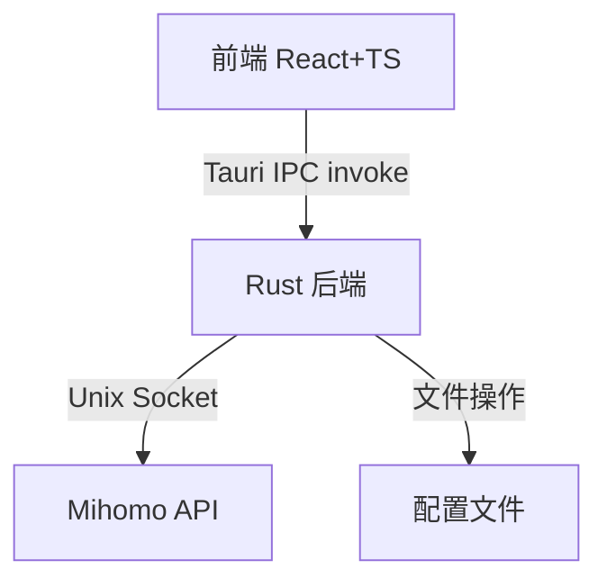
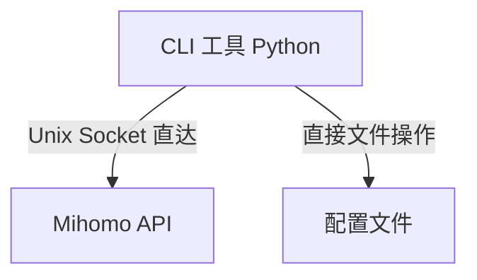
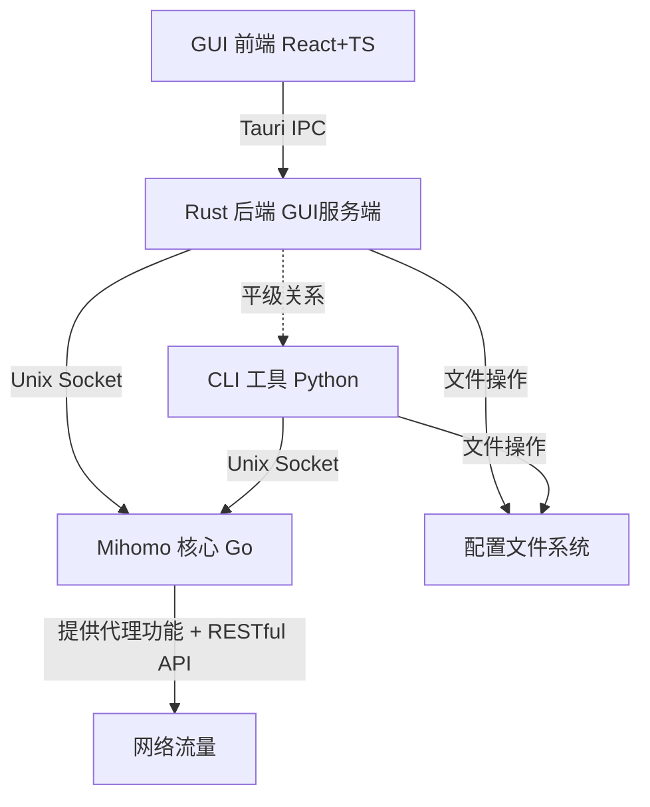
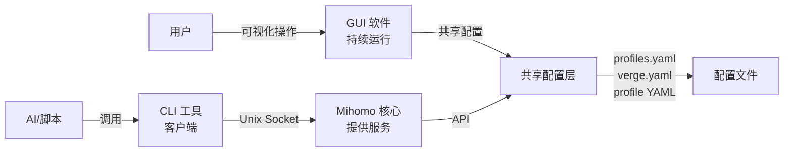

# Clash CLI 工具与 GUI 的关系分析

## 核心定位

> [!important] 关键洞察
> CLI 工具**不是**简单地把"客户端请求后端的代码转为 CLI"，而是**一个独立的客户端，直接访问 Mihomo API 和配置文件，与 Rust 后端平级**。

## 架构关系对比

### GUI 的通信路径



### CLI 的通信路径



> [!note] 绕过中间层
> CLI 工具跳过了 Tauri IPC 和 Rust 中间层，直接操作：
> - **Mihomo API** (通过 Unix Socket)
> - **配置文件** (profiles.yaml, verge.yaml, profile YAML 文件)

## 平级架构图



> [!tip] 数据源共享
> **两者都直接访问相同的数据源**：
> - 共享 `profiles.yaml` 配置
> - 共享 Mihomo Unix Socket API
> - 共享 profile YAML 文件

## 功能实现对比

| 功能 | GUI 前端 → Rust 后端 | CLI 工具 |
|------|---------------------|----------|
| Profile 管理 | invoke → Rust → 文件操作 | ==直接文件操作== ✅ |
| 代理切换 | invoke → Rust → Mihomo API | ==直接 Mihomo API== ✅ |
| 延迟测试 | invoke → Rust → Mihomo API | ==直接 Mihomo API== ✅ |
| 配置增强 | Rust 后端执行 enhance() | ==Python 实现 enhance 逻辑== ⚠️ (简化版) |
| 系统代理设置 | invoke → Rust → 系统设置 | ❌ 需要调用外部命令 |
| TUN 模式管理 | invoke → Rust → 服务管理 | ❌ 需要权限提升 |
| 流量可视化 | 前端渲染 + WebSocket | ❌ 无 GUI |
| 配置编辑器 | Monaco Editor | ✅ 命令行编辑 |

> [!warning] CLI 无法直接替代的部分
> - **系统级操作**（设置系统代理、TUN 模式、服务管理）需要 Rust 后端的系统权限和 Tauri 插件
> - **GUI 可视化**（流量图、实时监控、配置编辑器）是前端渲染功能
> - **Enhance 流程的完整实现** - CLI 目前简化了 enhance（merge/script 处理）

## CLI 工具的优势

> [!success] 自动化友好
> - **自动化友好**：脚本调用，JSON 输出
> - **轻量级**：无需启动 GUI 进程
> - **直接控制**：绕过 IPC 层，响应更快
> - **AI 代理可用**：命令行接口，标准输出

## 协同工作模式



> [!example] 使用场景分工
> - **GUI**：用户手动操作、可视化监控、复杂配置编辑
> - **CLI**：自动化脚本、AI 代理调用、批量操作、CI/CD 集成

## 技术栈对比

### GUI 技术栈

| 层级 | 技术 | 版本 |
|------|------|------|
| UI 层 | React | 19.2.4 |
| UI 层 | TypeScript | 6.0 |
| UI 层 | Vite | 8.0 |
| 应用后端 | Tauri | 2.10.3 |
| 应用后端 | Rust + Tokio | 1.50.0 |
| 核心引擎 | Mihomo (Go) | - |

### CLI 技术栈

| 组件 | 技术 | 版本 |
|------|------|------|
| CLI 框架 | Click | 8.1.8 |
| 包管理 | pip / PyPI | - |
| Mihomo 客户端 | Python + socket | - |
| 配置处理 | PyYAML | - |
| 异步支持 | asyncio | - |

## 实现差异示例

### Profile 导入流程对比

**GUI 路径**：

```typescript
// 前端调用
await invoke('import_profile', { url, option })

// ↓ Tauri IPC

// Rust 后端处理
#[tauri::command]
async fn import_profile(url: String, option: Option<PrfOption>) -> CmdResult {
    // 1. 下载订阅
    // 2. 解析 metadata
    // 3. 创建 PrfItem
    // 4. 保存文件
    // 5. 更新 profiles.yaml
}
```

**CLI 路径**：

```python
# CLI 直接处理
def import_profile_from_url(self, url: str, name: str):
    # 1. 下载订阅 (直接 HTTP 请求)
    # 2. 解析 metadata (直接解析 YAML)
    # 3. 创建 ProfileItem (直接操作)
    # 4. 保存文件 (直接写文件)
    # 5. 更新 profiles.yaml (直接修改)
```

> [!abstract] 绕过 IPC 层
> CLI 跳过了 Tauri IPC 的序列化/反序列化开销，直接操作文件和 API

## 未来改进方向

> [!todo] CLI 功能增强
> - [ ] 完整实现 enhance 流程（Merge/Script/Rules/Proxies/Groups）
> - [ ] 系统代理设置（调用系统命令）
> - [ ] 服务管理（需要 sudo/管理员权限）
> - [ ] WebDAV 备份集成
> - [ ] 流媒体解锁检测

## 相关笔记

- [[CLASH_VERGE_REV_ARCHITECTURE]] - 完整架构分析
- [[cli-anything-clash-verge-rev CLI 设计]] - CLI 工具实现细节
- [[Mihomo API 文档]] - Mihomo RESTful API 参考
- [[Profile 扩展系统]] - Merge/Script/Rules 扩展机制

## 总结

> [!quote] 核心结论
> CLI 工具不是 GUI 前端的"命令行版"，而是：
>
> **一个独立的客户端，直接访问 Mihomo API 和配置文件，与 Rust 后端平级，互补而非替代 GUI。**
>
> 它更适合自动化和 AI 集成场景，但无法完全替代 GUI 的系统级操作和可视化能力。两者协同工作，共享配置，各有侧重。

---

*Created: 2026-04-04*
*Tags: #clash #cli #python #architecture*