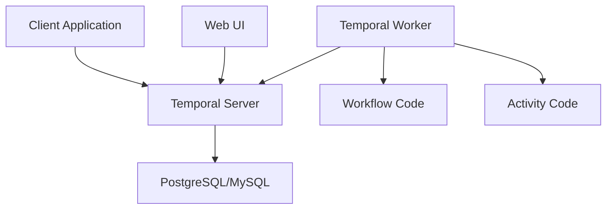
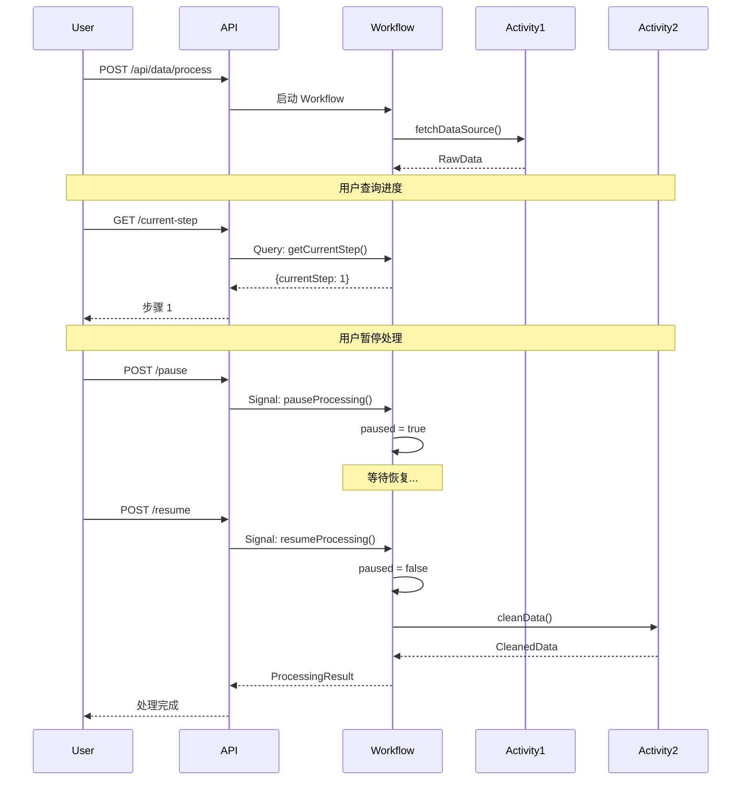

# Temporal 工作流框架完整指南

## 概述

Temporal 是一个开源的分布式工作流编排平台，用于构建可靠的长时运行应用程序。它解决了分布式系统中的编排问题，采用"中心化状态机 + 事件溯源"模式。

> [!tip] 核心价值
> Temporal 让你可以专注于业务逻辑，而不用担心分布式系统的复杂性（容错、重试、状态管理等）。

## 核心架构

### 架构组件



**核心组件说明：**

1. **Temporal Server**：中央协调服务，管理所有工作流状态和历史
2. **Temporal Worker**：执行工作流和活动代码的进程
3. **Workflow**：编排层，定义业务逻辑流程
4. **Activity**：执行层，执行具体业务操作
5. **Web UI**：可视化管理界面

### 三个核心概念

| 概念 | 角色 | 职责 | 比喻 |
|------|------|------|------|
| **Workflow** | 项目经理 | 编排整体流程，管理状态 | 不干活，只管调度 |
| **Activity** | 工人 | 执行具体业务逻辑 | 干脏活累活 |
| **Signal/Query** | 遥控器/仪表盘 | 动态控制和查询状态 | 运行时交互 |

## Workflow（工作流）

### 什么是 Workflow？

Workflow 是整个流程的"大脑"，负责编排各个步骤的执行顺序和逻辑。

**关键特性：**

1. **状态持久化**：Temporal 会自动持久化 Workflow 的所有状态变量
2. **确定性执行**：Workflow 代码必须是确定性的
3. **可恢复性**：服务重启后可以从断点继续执行

### Workflow 代码示例

```java
@WorkflowInterface
public interface DataProcessingWorkflow {
    @WorkflowMethod
    ProcessingResult processData(DataRequest request);

    @SignalMethod
    void pauseProcessing();

    @SignalMethod
    void resumeProcessing();

    @QueryMethod
    ProcessingStatus getStatus();
}
```

### Workflow 实现要点

> [!warning] 确定性要求
> Workflow 代码必须保证确定性，不能使用：
> - ❌ 随机数：`UUID.randomUUID()`, `Math.random()`
> - ❌ 当前时间：`System.currentTimeMillis()`, `LocalDate.now()`
> - ❌ 静态变量：`static int count`
> - ❌ 直接数据库访问：应该在 Activity 中进行

**正确做法：**

```java
// ✅ 使用 Temporal 提供的确定性 API
String workflowId = Workflow.getInfo().getWorkflowId();
long time = Workflow.currentTimeMillis();
```

### Workflow 状态管理

```java
public class DataProcessingWorkflowImpl implements DataProcessingWorkflow {

    // ✅ 这些状态变量会被 Temporal 自动持久化
    private ProcessingStatus status = ProcessingStatus.RUNNING;
    private int currentStep = 0;
    private boolean paused = false;

    @Override
    public ProcessingResult processData(DataRequest request) {
        // 记录当前步骤
        currentStep = 1;
        RawData raw = activity.fetchDataSource(request.getSourceUrl());

        currentStep = 2;
        CleanedData cleaned = activity.cleanData(raw);

        // 即使服务重启，Temporal 也会记住 currentStep=2
        // 下次从第 3 步继续执行

        status = ProcessingStatus.COMPLETED;
        return new ProcessingResult(true, "完成", currentStep);
    }
}
```

## Activity（活动）

### 什么是 Activity？

Activity 是真正干活的"工人"，执行具体的业务逻辑（调用 API、操作数据库、处理文件等）。

### ⚠️ 核心要求：幂等性（Idempotency）

> [!danger] 关键要点
> **Activity 最重要的要求是幂等性，而不是原子性！**
>
> 幂等性：同一个操作执行一次和执行多次，产生的结果是一样的。

### 为什么需要幂等性？

因为 **Activity 可能被重试多次**：

```java
@Override
public void sendEmail(String to, String subject, String body) {
    // 第 1 次执行：调用邮件 API
    emailService.send(to, subject, body);
    // ⚠️ 邮件已发送，但网络超时了
    // Temporal 认为失败了，触发重试

    // 第 2 次执行：再次调用邮件 API
    emailService.send(to, subject, body);
    // ❌ 用户收到了两封相同的邮件！
}
```

### 如何实现幂等性？

#### 方法 1：使用唯一 ID

```java
// ✅ 幂等实现：使用唯一事务 ID
@Override
public void addBonusPoints(String transactionId, String userId, int points) {
    // 检查是否已处理过
    Transaction existing = database.findTransaction(transactionId);
    if (existing != null) {
        return;  // 已处理，直接返回
    }

    // 处理业务逻辑
    User user = database.findUser(userId);
    user.points += points;
    database.save(user);

    // 记录事务
    database.saveTransaction(transactionId);
}

// 多次执行结果相同 ✅
// 第 1 次：检查无记录 → 增加积分 → 保存事务
// 第 2 次：检查有记录 → 直接返回（不会重复增加）
```

#### 方法 2：条件更新

```java
// ✅ 幂等实现：条件更新
@Override
public void updateOrderStatus(String orderId, String newStatus) {
    // 使用唯一约束或条件更新
    database.execute(
        "UPDATE orders SET status = ? WHERE id = ? AND status != ?",
        newStatus, orderId, newStatus
    );
    // 无论执行多少次，结果都是 status = newStatus
}

// ✅ 创建唯一订单
@Override
public void createOrder(String orderId, OrderData data) {
    Order existing = database.findOrderById(orderId);
    if (existing != null) {
        return;  // 已存在，不重复创建
    }
    database.insertOrder(orderId, data);
}
```

#### 方法 3：检查已处理

```java
// ✅ 幂等实现：检查是否已处理
@Override
public void sendEmail(String emailId, String to, String subject, String body) {
    // 使用唯一 emailId
    if (emailService.isSent(emailId)) {
        return;  // 已发送，不重复
    }
    emailService.send(emailId, to, subject, body);
}
```

### Activity 的重试策略

```java
// 在 Workflow 中配置 Activity 的重试策略
private final DataProcessingActivity activity = Workflow.newActivityStub(
    DataProcessingActivity.class,
    ActivityOptions.newBuilder()
        .setStartToCloseTimeout(Duration.ofMinutes(10))  // 整个 Activity 最多执行 10 分钟
        .setRetryOptions(RetryOptions.newBuilder()
            .setInitialInterval(Duration.ofSeconds(1))   // 第一次重试等待 1 秒
            .setMaximumInterval(Duration.ofSeconds(100)) // 最大等待 100 秒
            .setBackoffCoefficient(2.0)                  // 指数退避：1s → 2s → 4s → 8s
            .setMaximumAttempts(5)                       // 最多重试 5 次
            .build())
        .build()
);
```

**重试执行流程：**

```
第 1 次执行：fetchDataSource() 失败（网络超时）
等待 1 秒后重试

第 2 次执行：fetchDataSource() 失败（服务不可用）
等待 2 秒后重试

第 3 次执行：fetchDataSource() 失败（数据库连接失败）
等待 4 秒后重试

第 4 次执行：fetchDataSource() 成功 ✅
继续执行下一步
```

### Activity 不需要原子性

> [!note] 重要澄清
> Activity **不需要**是原子操作！
>
> - ✅ 可以执行很长时间（几分钟、几小时）
> - ✅ 可以包含多个步骤
> - ✅ 可以有中间状态
> - ❌ 但必须保证幂等性

**示例：复杂的 Activity**

```java
@Override
public RawData fetchLargeDataset(String url) {
    // 第 1 步：下载文件（可能需要 10 分钟）
    File tempFile = downloadFile(url);

    // 第 2 步：解压文件
    File extracted = unzipFile(tempFile);

    // 第 3 步：读取数据
    RawData data = readFile(extracted);

    // 第 4 步：清理临时文件
    cleanup(tempFile, extracted);

    return data;
    // 这个 Activity 执行了多个步骤
    // 如果失败，Temporal 会重试整个 Activity
}
```

### 长时运行的 Activity：Heartbeat 机制

对于执行时间很长的 Activity（如处理大文件），使用 Heartbeat 机制：

```java
@Override
public void processLargeFile(String filePath) {
    File file = new File(filePath);
    long totalLines = countLines(file);

    try (BufferedReader reader = new BufferedReader(new FileReader(file))) {
        String line;
        long processedLines = 0;

        while ((line = reader.readLine()) != null) {
            // 处理每一行
            processLine(line);
            processedLines++;

            // ✅ 每 1000 行发送一次心跳
            if (processedLines % 1000 == 0) {
                Activity.getExecutionContext().heartbeat(processedLines);
                // Temporal 记录进度：已处理 processedLines 行
            }
        }
    }
}
```

**Heartbeat 的作用：**

```
执行过程：
第 1 次执行：
  - 处理到第 5000 行
  - 发送 heartbeat(5000)
  - 继续处理...
  - 处理到第 10000 行
  - 服务突然崩溃 ❌

Temporal 记录：最后的心跳 = 10000

第 2 次执行（自动重试）：
  - Temporal 告诉 Activity："上次处理到第 10000 行"
  - Activity 从第 10001 行继续处理 ✅
```

### Activity 设计最佳实践

> [!tip] 推荐：拆分为多个小 Activity

```java
// ❌ 错误设计：Activity 太复杂，难以保证幂等性
@Override
public void processOrder(Order order) {
    // 步骤 1：扣减库存
    inventoryService.deductStock(order.getProductId(), order.getQuantity());

    // 步骤 2：创建订单
    orderService.createOrder(order);

    // 步骤 3：发送通知
    notificationService.sendEmail(order.getUserId(), "订单创建成功");

    // 如果步骤 3 失败，重试会导致重复扣减库存 ❌
}

// ✅ 正确设计：拆分为多个 Activity
@WorkflowMethod
public void processOrder(Order order) {
    // Activity 1：扣减库存（幂等）
    inventoryActivity.deductStock(order.getProductId(), order.getQuantity());

    // Activity 2：创建订单（幂等）
    orderActivity.createOrder(order);

    // Activity 3：发送通知（幂等）
    notificationActivity.sendEmail(order.getId(), order.getUserId(), "订单创建成功");

    // 如果 Activity 3 失败，只重试发送邮件 ✅
}
```

**优点：**
- 更容易实现幂等性
- 失败后重试代价小
- 更容易理解和维护

## Signal（信号）- 动态控制

### 什么是 Signal？

Signal 就像"遥控器"，可以在 Workflow 运行过程中动态控制它的行为（暂停、恢复、取消等）。

### Signal 代码示例

```java
@WorkflowInterface
public interface DataProcessingWorkflow {
    @SignalMethod
    void pauseProcessing();

    @SignalMethod
    void resumeProcessing();

    @SignalMethod
    void cancelProcessing(String reason);
}
```

### Workflow 中处理 Signal

```java
public class DataProcessingWorkflowImpl implements DataProcessingWorkflow {
    private boolean paused = false;
    private boolean cancelled = false;

    @Override
    public ProcessingResult processData(DataRequest request) {
        // 第 1 步
        checkPausedOrCancelled();
        RawData raw = activity.fetchDataSource(request.getSourceUrl());

        // 第 2 步
        checkPausedOrCancelled();
        CleanedData cleaned = activity.cleanData(raw);

        // ...
    }

    private void checkPausedOrCancelled() {
        if (cancelled) {
            throw new RuntimeException("处理已取消");
        }

        // 如果被暂停，就一直等待
        while (paused && !cancelled) {
            Workflow.sleep(Duration.ofSeconds(1));  // 每秒检查一次
        }
    }

    @Override
    public void pauseProcessing() {
        this.paused = true;
    }

    @Override
    public void resumeProcessing() {
        this.paused = false;
    }
}
```

### 使用 Signal

```bash
# 启动 Workflow
curl -X POST http://localhost:9991/api/data/process

# 暂停
curl -X POST http://localhost:9991/api/data/{workflowId}/pause

# 恢复
curl -X POST http://localhost:9991/api/data/{workflowId}/resume

# 取消
curl -X POST http://localhost:9991/api/data/{workflowId}/cancel?reason=数据源不可用
```

## Query（查询）- 实时监控

### 什么是 Query？

Query 就像一个"仪表盘"，可以实时查询 Workflow 的状态和进度。

### Query 代码示例

```java
@WorkflowInterface
public interface DataProcessingWorkflow {
    @QueryMethod
    ProcessingStatus getStatus();

    @QueryMethod
    int getCurrentStep();
}

public class DataProcessingWorkflowImpl implements DataProcessingWorkflow {
    private ProcessingStatus status = ProcessingStatus.RUNNING;
    private int currentStep = 0;

    @Override
    public ProcessingStatus getStatus() {
        return status;
    }

    @Override
    public int getCurrentStep() {
        return currentStep;
    }
}
```

### 使用 Query

```bash
# 查询状态
curl -X GET http://localhost:9991/api/data/{workflowId}/status
# 返回："RUNNING"

# 查询当前步骤
curl -X GET http://localhost:9991/api/data/{workflowId}/current-step
# 返回：{"currentStep": 3}
```

## 完整场景演示

### 场景：数据处理流水线

```java
@WorkflowMethod
public ProcessingResult processData(DataRequest request) {
    try {
        // Step 1: 获取数据
        currentStep = 1;
        checkPausedOrCancelled();
        RawData rawData = activity.fetchDataSource(request.getSourceUrl());

        // Step 2: 清洗数据
        currentStep = 2;
        checkPausedOrCancelled();
        CleanedData cleanedData = activity.cleanData(rawData);

        // Step 3: 转换数据
        currentStep = 3;
        checkPausedOrCancelled();
        TransformedData transformedData = activity.transformData(
            cleanedData,
            request.getTransformConfig()
        );

        // Step 4: 存储数据
        currentStep = 4;
        checkPausedOrCancelled();
        activity.storeData(transformedData, request.getTargetLocation());

        status = ProcessingStatus.COMPLETED;
        return new ProcessingResult(true, "数据处理完成", currentStep);

    } catch (Exception e) {
        status = ProcessingStatus.FAILED;
        return new ProcessingResult(false, "处理失败: " + e.getMessage(), currentStep);
    }
}
```

### 执行流程可视化



## Temporal vs 传统方式对比

| 特性 | 传统方式 | Temporal |
|------|----------|----------|
| **容错性** | ❌ 任何步骤失败需要重头开始 | ✅ 自动重试，失败后从断点继续 |
| **状态监控** | ❌ 需要手动记录到数据库 | ✅ 自动持久化，实时 Query 查询 |
| **动态控制** | ❌ 启动后无法暂停/取消 | ✅ Signal 动态控制 |
| **服务重启** | ❌ 状态丢失 | ✅ 自动恢复 |
| **重试逻辑** | ❌ 需要手动编写 | ✅ 自动配置重试策略 |
| **可视化** | ❌ 需要自己开发监控页面 | ✅ Web UI 实时查看 |

## 幂等性实现模式总结

> [!success] 幂等性实现的几种模式

### 模式 1：唯一 ID 模式

```java
public void process(String transactionId, Data data) {
    if (isProcessed(transactionId)) {
        return;  // 已处理，直接返回
    }
    doProcess(data);
    markAsProcessed(transactionId);
}
```

### 模式 2：条件更新模式

```java
public void updateStatus(String orderId, String newStatus) {
    // 使用唯一约束或 WHERE 条件
    UPDATE orders SET status = ? WHERE id = ? AND status != ?
}
```

### 模式 3：检查-执行模式

```java
public void createOrder(String orderId, OrderData data) {
    Order existing = findById(orderId);
    if (existing != null) {
        return;  // 已存在，不重复创建
    }
    insert(orderId, data);
}
```

### 模式 4：自然幂等模式

```java
// 某些操作天然幂等
public void setUserAge(String userId, int age) {
    // 设置操作：多次执行结果相同
    user.age = age;
}

public int calculateSum(List<Integer> numbers) {
    // 纯函数：相同输入，相同输出
    return numbers.stream().mapToInt(n -> n).sum();
}
```

## 安装和配置

### Docker Compose 配置

```yaml
name: temporal-springboot

services:
  postgres:
    image: postgres:13
    environment:
      POSTGRES_PASSWORD: temporal
      POSTGRES_USER: temporal
      POSTGRES_DB: temporal

  temporal:
    image: temporalio/auto-setup:latest
    depends_on:
      - postgres
    ports:
      - "7233:7233"
    environment:
      - DB=postgres12
      - DB_PORT=5432
      - POSTGRES_USER=temporal
      - POSTGRES_PWD=temporal
      - POSTGRES_DB=temporal
      - POSTGRES_SEEDS=postgres

  temporal-ui:
    image: temporalio/ui:latest
    depends_on:
      - temporal
    ports:
      - "8233:8080"
    environment:
      - TEMPORAL_ADDRESS=temporal:7233
```

### Maven 依赖

```xml
<dependency>
    <groupId>io.temporal</groupId>
    <artifactId>temporal-sdk</artifactId>
    <version>1.23.1</version>
</dependency>
```

### Spring Boot 配置

```yaml
temporal:
  host: localhost
  port: 7233
  namespace: default
  task-queue: demo-task-queue
```

## 最佳实践清单

> [!check] Activity 设计检查清单

- [ ] **幂等性**：Activity 是否支持多次执行结果相同？
- [ ] **唯一 ID**：是否使用唯一事务 ID 防止重复处理？
- [ ] **重试安全**：失败重试是否会产生副作用？
- [ ] **超时设置**：是否设置了合理的超时时间？
- [ ] **异常处理**：是否正确抛出异常以触发重试？
- [ ] **Heartbeat**：长时间运行是否发送心跳？
- [ ] **资源清理**：失败后是否清理临时资源？

> [!check] Workflow 设计检查清单

- [ ] **确定性**：是否避免了随机数、当前时间等非确定性操作？
- [ ] **状态管理**：是否使用成员变量持久化状态？
- [ ] **Activity 超时**：是否配置了合理的 Activity 超时？
- [ ] **重试策略**：是否配置了合适的重试策略？
- [ ] **Signal 处理**：是否支持暂停/恢复/取消？
- [ ] **Query 支持**：是否提供了状态查询接口？

## 常见问题

### Q1: Activity 执行时间有限制吗？

> [!note] 执行时间
> Activity 执行时间由 `setStartToCloseTimeout` 控制，可以设置为几分钟到几小时。
> 对于特别长时间的任务，建议使用 Heartbeat 机制。

### Q2: Workflow 可以调用其他 Workflow 吗？

```java
// ✅ 可以使用 Child Workflow
ChildWorkflowStub child = Workflow.newChildWorkflowStub(ChildWorkflow.class);
child.process(data);
```

### Q3: 如何保证 Activity 幂等性？

> [!tip] 核心方法
> 1. 使用唯一事务 ID
> 2. 检查是否已处理
> 3. 使用条件更新
> 4. 设计自然幂等操作

### Q4: 服务重启后 Workflow 会丢失吗？

> [!success] 不会丢失
> Temporal Server 会持久化所有 Workflow 状态。服务重启后，Worker 会自动重新连接并继续执行未完成的 Workflow。

## 相关资源

- [[Temporal 官方文档]](https://docs.temporal.io/)
- [[Temporal Java SDK]](https://github.com/temporalio/sdk-java)
- [[Temporal 示例代码]](https://github.com/temporalio/samples-java)
- [[本项目数据处理流水线实现]]

## 标签

#temporal #workflow #distributed-systems #java #幂等性 #微服务架构