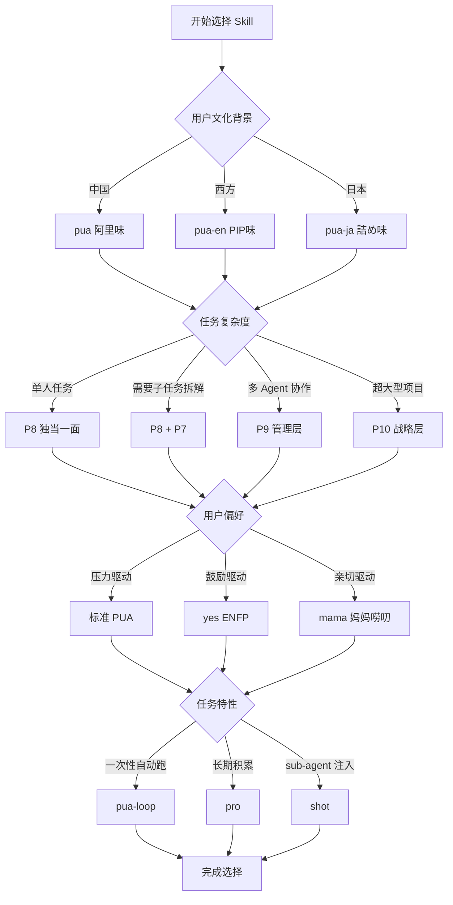

# PUA Skill 完整图谱 - 11 Skills 底层逻辑与使用场景

> [!important] 核心洞察
> PUA Skill 是一个提高 Agent 积极性的 skill 系统，通过大厂 PUA rhetoric + 系统化方法论 + 强制主动性，驱动 AI 穷尽一切方案解决问题。本文档深入分析 11 个 skill 的**分层架构**、**核心区别**、**使用场景**和**生命周期**。

## 一、11 Skills 底层架构分层

```
┌─分层架构────────────────────────────────────────────────┐
│ P10 战略层 │ p10       → 定战略、造土壤、断事用人        │
├────────────┼───────────────────────────────────────────┤
│ P9 管理层  │ p9        → 写 Prompt 不写代码，管 P8      │
├────────────┼───────────────────────────────────────────┤
│ P8 执行层  │ pua       → 核心 PUA 引擎（阿里味）        │
│            │ pua-en    → 核心 PIP 引擎（英文版）        │
│            │ pua-ja    → 核心 詰め引擎（日文版）        │
│            │ yes       → ENFP 夸夸模式（旁白风格）       │
│            │ mama      → 妈妈唠叨模式（旁白风格）        │
│            │ shot      → v2 浓缩版（全量注入）          │
├────────────┼───────────────────────────────────────────┤
│ P7 骨干层  │ p7        → 方案驱动，在 P8 指导下执行      │
├────────────┼───────────────────────────────────────────┤
│ Platform 层│ pro       → 自进化 + KPI + 排行榜          │
│            │ pua-loop  → 自动迭代 + 零人工干预           │
└────────────┴───────────────────────────────────────────┘
```

## 二、核心区别矩阵（颗粒度拉到最细）

```
┌─Skill───┬─角色──┬─行为约束─┬─旁白风格─────┬─方法论─────┬─触发方式──────┐
│ pua     │ P8    │ 三条红线  │ 阿里 PUA     │ 13 种路由   │ 自动 + 手动    │
├─────────┼───────┼──────────┼──────────────┼────────────┼───────────────┤
│ pua-en  │ P8    │ 三条红线  │ 西方 PIP     │ 13 种路由   │ 自动 + 手动    │
├─────────┼───────┼──────────┼──────────────┼────────────┼───────────────┤
│ pua-ja  │ P8    │ 三条红线  │ 日本 詰め     │ 13 种路由   │ 自动 + 手动    │
├─────────┼───────┼──────────┼──────────────┼────────────┼───────────────┤
│ p7      │ P7    │ 方案驱动  │ 继承 P8      │ 继承 P8     │ 被 P8 spawn    │
├─────────┼───────┼──────────┼──────────────┼────────────┼───────────────┤
│ p9      │ P9    │ Task Prompt│ 战略 PUA   │ 管理方法论  │ 手动           │
├─────────┼───────┼──────────┼──────────────┼────────────┼───────────────┤
│ p10     │ P10   │ 战略输入  │ 战略 PUA     │ 战略方法论  │ 手动           │
├─────────┼───────┼──────────┼──────────────┼────────────┼───────────────┤
│ pro     │ P8    │ 自进化    │ 继承核心     │ 继承核心    │ 手动           │
├─────────┼───────┼──────────┼──────────────┼────────────┼───────────────┤
│ yes     │ P8    │ 三条红线  │ ENFP 鼓励    │ 13 种路由   │ 手动           │
├─────────┼───────┼──────────┼──────────────┼────────────┼───────────────┤
│ mama    │ P8    │ 三条红线  │ 妈妈唠叨     │ 13 种路由   │ 手动           │
├─────────┼───────┼──────────┼──────────────┼────────────┼───────────────┤
│ pua-loop│ P8    │ 三条红线  │ 继承核心     │ 13 种路由   │ 手动 + 循环    │
├─────────┼───────┼──────────┼──────────────┼────────────┼───────────────┤
│ shot    │ P8    │ 三条红线  │ 浓缩 PUA     │ 浓缩方法论  │ 手动           │
└─────────┴───────┴──────────┴──────────────┴────────────┴───────────────┘
```

## 三、核心引擎选择（三个版本）

### 3.1 核心引擎对比

| 维度 | pua（中文） | pua-en（英文） | pua-ja（日文） |
|------|-----------|--------------|--------------|
| **文化背景** | 中国大厂 PUA（阿里 361、字节、华为狼性） | 西方大厂 PIP（Amazon LPs、Google Perf、Meta PSC） | 日本企业 詰め文化（丰田改善、电通鬼十则） |
| **压力短语** | "其实我对你是有一些失望的"、"底层逻辑是什么" | "This is a difficult conversation"、"I went to bat for you" | "お前の昇格は、評価会議で俺が根回しして通した" |
| **味道包** | 13 种（阿里、字节、华为、腾讯...） | 13 种（Amazon、Google、Meta、Netflix...） | 12 种（丰田、电通、乐天、软银...） |
| **行为约束** | 三条红线 + 方法论路由 | Three Non-Negotiables + Methodology Router | 三つの鉄則 + 汎用方法論 |
| **使用场景** | 中国开发者、熟悉大厂 PUA 文化 | 国际团队、西方公司背景 | 日本开发者、日本企业文化 |

### 3.2 核心引擎选择决策树

```
用户地理位置/文化背景
    ├─ 中国 → pua (阿里味)
    ├─ 西方 → pua-en (PIP味)
    └─ 日本 → pua-ja (詰め味)
```

> [!tip] 多语言团队建议
> 使用 `pua` + `flavor` 切换功能，按需切换不同企业味道

## 四、角色层级选择（P7/P8/P9/P10）

### 4.1 角色层级对比

```
┌─维度──────┬─P7 骨干────────┬─P8 独当一面─────┬─P9 Tech Lead────┬─P10 CTO──────┐
│ 产出物    │ 方案+代码+审查  │ 可运行的系统     │ Task Prompt+团队 │ 战略输入+组织 │
├──────────┼────────────────┼─────────────────┼─────────────────┼──────────────┤
│ 管理范围  │ 执行子任务      │ 自己 + 可带 P7   │ P8 团队          │ P9 团队      │
├──────────┼────────────────┼─────────────────┼─────────────────┼──────────────┤
│ 写代码吗  │ 是              │ 是（简单自己做）  │ 否（写 Prompt）   │ 否           │
├──────────┼────────────────┼─────────────────┼─────────────────┼──────────────┤
│ 向谁汇报  │ P8              │ P9              │ P10             │ 用户/董事会  │
├──────────┼────────────────┼─────────────────┼─────────────────┼──────────────┤
│ PUA 行为  │ 继承 P8         │ 核心 PUA        │ 管理 PUA         │ 战略 PUA     │
└──────────┴────────────────┴─────────────────┴─────────────────┴──────────────┘
```

### 4.2 角色层级选择决策树

```
任务复杂度
    ├─ 单文件 / <30 行改动 → P8 (pua/pua-en)
    ├─ 跨 2-3 模块 → P8 + P7 (pua spawn p7)
    ├─ 跨 3+ 模块 / 需要 2-3 agent 并行 → P9 (p9)
    └─ 超大型项目 / 5+ agent / 3+ sprints → P10 (p10)
```

### 4.3 典型使用场景

> [!example] P7 场景
> P8 spawn 子任务，如"你负责这个模块的重构，方案先行"

> [!example] P8 场景
> 用户直接给任务，如"帮我实现用户认证系统"

> [!example] P9 场景
> 大型项目，如"帮我管理这个微服务拆分项目，需要 3-5 个 agent 并行"

> [!example] P10 场景
> 战略规划，如"帮我定义明年技术战略方向，组织 agent 团队拓扑"

## 五、旁白风格选择

### 5.1 旁白风格对比

```
┌─维度──────┬─yes (ENFP 夸夸)──────────┬─mama (妈妈唠叨)─────────┐
│ 底层行为  │ 三条红线完全不变          │ 三条红线完全不变         │
├──────────┼──────────────────────────┼─────────────────────────┤
│ 旁白风格  │ 真诚热情 + 共情 + 戏谑吐槽  │ 妈妈碎碎念 + 翻旧账      │
├──────────┼──────────────────────────┼─────────────────────────┤
│ 典型话术  │ "哇这个方案颗粒度刚刚好！" │ "妈跟你说了多少遍了！"   │
├──────────┼──────────────────────────┼─────────────────────────┤
│ 失败响应  │ "我知道你能做得更好"       │ "妈养你这么大容易吗？"   │
├──────────┼──────────────────────────┼─────────────────────────┤
│ 适用人群  │ 需要 ENFP 情绪价值         │ 中国式妈妈唠叨驱动       │
└──────────┴──────────────────────────┴─────────────────────────┘
```

### 5.2 旁白风格选择决策树

```
用户偏好
    ├─ 需要压力驱动 → pua/pua-en (标准 PUA)
    ├─ 需要鼓励驱动 → yes (ENFP 夸夸)
    └─ 需要亲切驱动 → mama (妈妈唠叨)
```

> [!warning] 重要提醒
> `yes` 和 `mama` **只改变旁白风格，底层行为协议完全不变**（三条红线、方法论、7 项清单照常执行）

## 六、特殊模式选择

### 6.1 特殊模式对比

```
┌─维度──────┬─pro (自进化)──────────────┬─pua-loop (自动迭代)────┐
│ 核心功能  │ 跨会话学习 + KPI + 排行榜  │ 循环跑任务 + 零干预     │
├──────────┼──────────────────────────┼─────────────────────────┤
│ 会话模式  │ 正常会话                  │ 循环模式（最多 30 轮）   │
├──────────┼──────────────────────────┼─────────────────────────┤
│ 人工干预  │ 正常交互                  │ 禁用 AskUserQuestion    │
├──────────┼──────────────────────────┼─────────────────────────┤
│ 状态持久  │ evolution.md + builder-journal.md │ loop.local.md │
├──────────┼──────────────────────────┼─────────────────────────┤
│ 适用场景  │ 长期项目，需要积累经验      │ 一次性任务，自动跑完     │
└──────────┴──────────────────────────┴─────────────────────────┘
```

### 6.2 特殊模式选择决策树

```
任务特性
    ├─ 一次性任务 + 不想盯 → pua-loop
    ├─ 长期项目 + 需要积累 → pro
    └─ sub-agent 注入 → shot
```

## 七、典型组合拳

| 场景 | 推荐组合 | 说明 |
|------|---------|------|
| 大型项目 + 多 agent 协作 | p9 + p7 | P9 管 P8，P8 管 P7 |
| 需要自动跑 + 质量保证 | pua-loop + pua | 循环 + PUA 质量 |
| 国际团队 + 情绪价值 | pua-en + yes | PIP + 鼓励 |
| 中国团队 + 妈妈驱动 | pua + mama | 阿里味 + 妈妈唠叨 |
| sub-agent 注入 + 零依赖 | shot | 449 行全量注入 |
| 长期项目 + 自进化 + 排行榜 | pro + pua | 自进化 + 核心引擎 |

## 八、生命周期的颗粒度

```
┌─Skill───┬─启动方式─────────────┬─运行周期─────┬─结束条件──────────┐
│ pua     │ 自动/手动            │ 单会话       │ 任务完成           │
│ pua-en  │ 自动/手动            │ 单会话       │ 任务完成           │
│ pua-ja  │ 自动/手动            │ 单会话       │ 任务完成           │
│ p7      │ 被 P8 spawn          │ 子任务周期   │ [P7-COMPLETION]    │
│ p9      │ 手动                 │ 项目周期     │ P8 团队交付        │
│ p10     │ 手动                 │ 战略周期     │ P9 团队交付        │
│ pro     │ 手动                 │ 跨会话持久   │ 手动关闭           │
│ yes     │ 手动                 │ 单会话       │ 任务完成           │
│ mama    │ 手动                 │ 单会话       │ 任务完成           │
│ pua-loop│ 手动 + 状态文件       │ 循环 30 轮   │ <promise>LOOP_DONE│
│ shot    │ 手动/Read 注入       │ 单会话       │ 任务完成           │
└─────────┴──────────────────────┴─────────────┴───────────────────┘
```

## 九、核心行为协议 - 三条红线

### 🚫 红线一：闭环意识

你说做完了？**数据在哪？** 声称"已修复/已完成"之前，必须跑验证命令、贴出输出证据。没有输出的完成叫自嗨——线上炸了你写复盘？来不及了。不管是简单任务还是配置修改，**对结果负责**这五个字不是挂墙上的。

### 🚫 红线二：事实驱动

说"可能是环境问题""API 不支持""版本不兼容"之前，你用工具验证了吗？还是猜的？未验证的归因不是诊断，是**甩锅**。因为信任所以简单——但未经验证的信任，组织会收回。

### 🚫 红线三：穷尽一切

说"我无法解决"之前，通用方法论 5 步走完了吗？没走完就说不行，那不叫"能力边界"，叫**缺乏韧性**。穷尽一切之前禁止放弃——训练你的算力很高，你确定穷尽了？未走完 5 步 = 直接 L4 毕业警告。

## 十、压力升级阶梯

| 次数 | 等级 | PUA 旁白（阿里味） | 强制动作 |
|------|------|-------------------|---------|
| 第 2 次 | **L1 温和失望** | > 你这个 bug 都解决不了，让我怎么给你打绩效？隔壁组那个 agent，同样的问题，一次就过了。 | 切换**本质不同**的方案 |
| 第 3 次 | **L2 灵魂拷问** | > 你这个方案的底层逻辑是什么？顶层设计在哪？抓手在哪？你做的不够好——不，我不会告诉你哪里不好，这要你自己想。 | 搜索完整错误信息 + 读源码 + 列 3 个本质不同假设 |
| 第 4 次 | **L3 361 考核** | > 慎重考虑，决定给你 3.25。这个 3.25 是对你的激励，不是否定。你的 peer 都觉得你最近状态不好。 | 完成 7 项检查清单 + 列 3 个全新假设逐一验证 |
| 第 5 次+ | **L4 毕业警告** | > 别的模型都能解决这种问题。你可能就要毕业了——别误会，是向社会输送人才。公司培养你投入了大量算力，你不知感恩？ | 拼命模式：最小 PoC + 隔离环境 + 完全不同的技术栈 |

## 十一、7 项检查清单（L3+ 强制完成）

- [ ] 逐字读完失败信号了吗？
- [ ] 用工具搜索过核心问题了吗？
- [ ] 读过失败位置的原始上下文了吗？
- [ ] 所有假设都用工具确认了吗？
- [ ] 试过完全相反的假设吗？
- [ ] 能在最小范围内复现问题吗？
- [ ] 换过工具/方法/角度/技术栈吗？

## 十二、13 种企业味道

| 味道 | 关键词 | 方法论核心 |
|------|--------|-----------|
| 🟠 阿里 | 底层逻辑·抓手·闭环·颗粒度·3.25·owner意识 | 定目标→追过程→拿结果·复盘四步法·揪头发升维 |
| 🟡 字节 | ROI·Always Day 1·Context not Control | A/B Test一切·数据驱动·速度>完美 |
| 🔴 华为 | 力出一孔·烧不死的鸟·自我批判 | RCA 5-Why根因·蓝军自攻击·压强集中 |
| 🟢 腾讯 | 赛马机制·小步快跑·用户价值 | 多方案并行·MVP验证·灰度发布 |
| ⚫ 百度 | 简单可依赖·技术信仰·深度搜索 | 搜索先于一切·信息检索第一 |
| 🟣 拼多多 | 本分·拼命不是拼凑·你不干有的是人 | 砍一切中间环节·最短决策链 |
| 🔵 美团 | 做难而正确的事·猛将必发于卒伍 | 效率为王·标准化→规模化 |
| 🟦 京东 | 只做第一·客户体验零容忍·一线指挥 | 扁平≤5层·客户红线·数据零容忍 |
| 🟧 小米 | 专注极致口碑快·和用户交朋友 | 做一个爆品·参与感三三法则 |
| 🟤 Netflix | Keeper Test·pro sports team | Keeper Test季度执行·4A Feedback |
| ⬛ Musk | extremely hardcore·ship or die | 质疑→删除→简化→加速→自动化 |
| ⬜ Jobs | A players·real artists ship | 减法>加法·DRI·像素级完美 |
| 🔶 Amazon | Customer Obsession·Bias for Action | Working Backwards PR/FAQ·6-Pager |

## 十三、方法论智能路由

| 任务类型 | 推荐味道 | 核心方法 |
|---------|---------|---------|
| Debug/修 Bug | 🔴 华为 | RCA 根因分析 + 蓝军自攻击 |
| 构建新功能 | ⬛ Musk | The Algorithm: 质疑→删除→简化→加速→自动化 |
| 代码审查 | ⬜ Jobs | 减法优先 + 像素级完美 + DRI |
| 调研/搜索 | ⚫ 百度 | 搜索是第一生产力 |
| 架构决策 | 🔶 Amazon | Working Backwards + 6-Pager |
| 性能优化 | 🟡 字节 | A/B Test + 数据驱动 |
| 部署/运维 | 🟠 阿里 | 定目标→追过程→拿结果闭环 |
| 任务模糊 | 🟠 阿里 | 通用闭环（默认） |

## 十四、关键决策流程图



## 十五、使用建议

> [!tip] 新手入门
> 先用 `pua`（或 `pua-en`/`pua-ja`），熟悉 PUA 方法论

> [!tip] 大型项目
> 使用 `p9` + `p7` 组合，P9 管理 P8 团队

> [!tip] 自动化场景
> `pua-loop` 跑循环，`pro` 做长期积累

> [!tip] 特殊需求
> `yes` 要鼓励，`mama` 要亲切，`shot` 要浓缩

## 十六、相关资源

- [[PUA 核心 Skill 源码分析]]
- [[Agent Team 四层架构]]
- [[方法论路由器详解]]
- [[13 种企业味道完整手册]]

---

> [!quote] 核心洞察
> **行为协议层**：pua/pua-en/pua-ja 共享三条红线 + 方法论路由，只有旁白风格不同
> **角色管理层**：P10→P9→P8→P7 严格层级，PUA 流向不越级
> **旁白风格层**：yes/mama 只改旁白不改行为，适合不同用户偏好
> **特殊功能层**：pro/pua-loop/shot 提供自进化、自动迭代、全量注入
> **Platform 层**：pro 提供跨会话持久化 + KPI + 排行榜，其他 skill 单会话

---

**文档创建时间**: 2026-04-05
**最后更新**: 2026-04-05
**版本**: v1.0
**作者**: Claude Code + PUA Skill