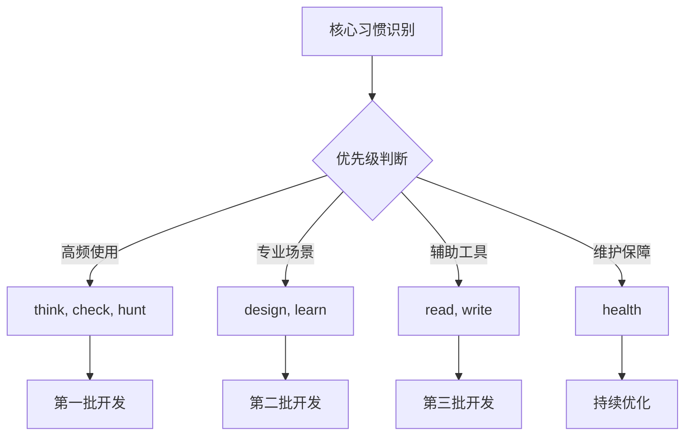
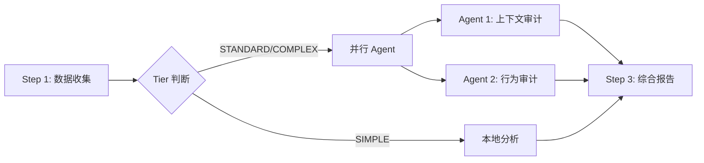
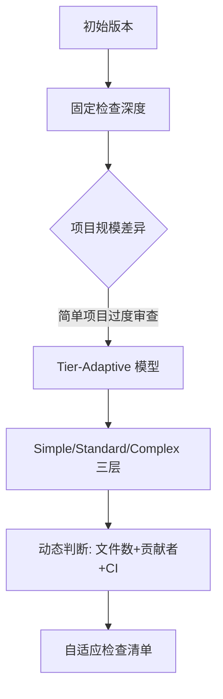
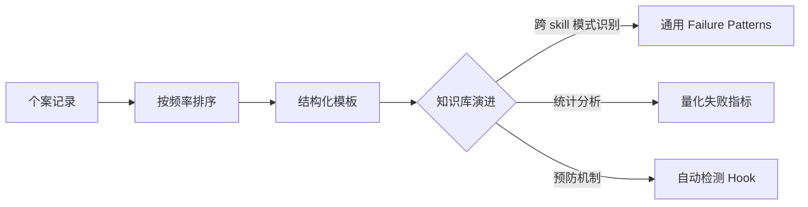
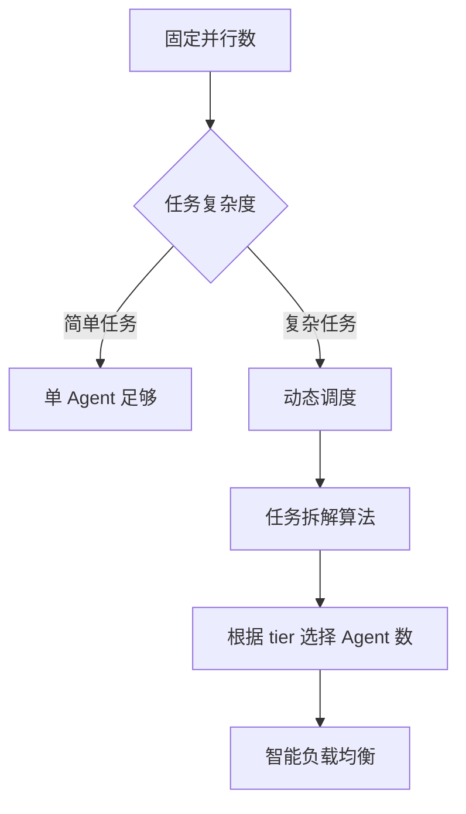
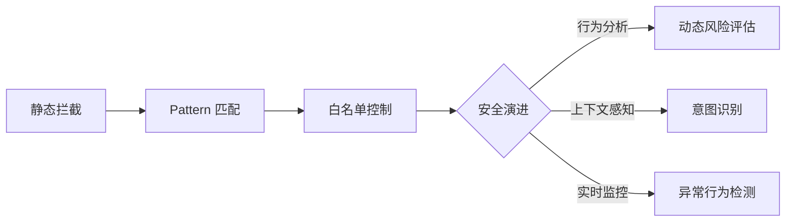
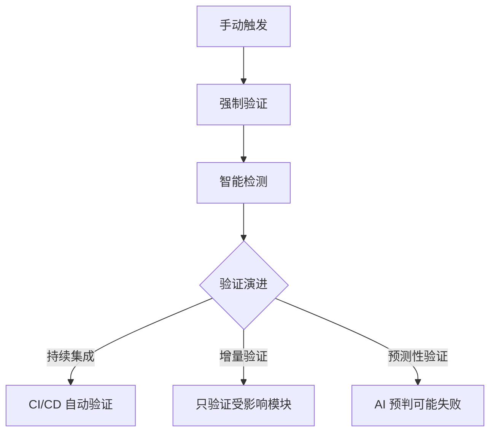

# Waza Skill 生命周期分析

> [!abstract] 核心理念
> **Waza (技)** — 日语武术术语，意为"技法"：练习到本能的动作。不是功能覆盖度，而是覆盖真正重要的工程习惯。

## 设计阶段

### 理念形成

> [!quote] 设计哲学
> "A good engineer does not just write code. They think through requirements, review their own work, debug systematically, design interfaces that feel intentional, and read primary sources."
> — Tw93, Waza README

**核心理念演进**：

1. **问题识别**：现有 skills 项目（Superpowers、gstack）过于重型，学习曲线陡峭
2. **定位明确**：聚焦**真正重要的习惯**，而非功能完整性
3. **命名哲学**：Waza = 练习至本能，强调**行为固化**而非工具堆叠

**设计目标**：

- [x] 覆盖完整工程工作流（设计→调试→审查→学习）
- [x] 每个技能有**明确触发时机**，避免滥用
- [x] 从真实失败中学习，沉淀 Gotchas
- [x] 轻量级，易于安装和更新

### 需求定义

> [!important] 八大核心技能
> 每个 skill 对应一个工程习惯，有明确的"何时用/何时不用"

| Skill | 触发时机 | 核心价值 | 对应习惯 |
|-------|---------|---------|---------|
| `/think` | 构建新功能前 | 设计先行，零代码直到批准 | **思考习惯** |
| `/design` | 构建 UI | 有观点设计，避免模板 | **审美判断** |
| `/check` | 任务完成/合并前 | Diff 审查，自动修复，安全钩子 | **质量把关** |
| `/hunt` | Bug/崩溃 | 根因优先，禁止猜测性修复 | **系统调试** |
| `/write` | 写作 prose | 自然表达，去除 AI 痕迹 | **清晰表达** |
| `/learn` | 新领域研究 | 六阶段工作流，产出导向 | **深度学习** |
| `/read` | URL/PDF | 代理级联，干净 Markdown | **一手资料** |
| `/health` | 配置审计 | 六层框架，自适应深度 | **系统维护** |

**需求优先级排序**：



## 开发阶段

### 结构设计

> [!tip] 架构模式
> **每个 skill 是一个完整目录**，而非单个文件。支持引用文档、脚本、子 agent 定义。

**标准目录结构**：

```
skills/
├── think/
│   └── SKILL.md              # 核心技能定义（必须）
├── design/
│   ├── SKILL.md
│   └── references/           # 参考文档（可选）
│       └── design-reference.md
├── check/
│   ├── SKILL.md
│   └── scripts/              # 工具脚本（可选）
│       ├── check-destructive.sh
│       └── verify.sh
├── health/
│   ├── SKILL.md
│   └── agents/               # 子 agent 定义（可选）
│       ├── agent1-context.md
│       └── agent2-control.md
```

**关键设计决策**：

1. **模块化**: skill 可以独立安装（`npx skills add -s health`）
2. **引用分离**: 大型参考文档放在 `references/`，避免 SKILL.md 过长
3. **脚本封装**: 工具脚本放在 `scripts/`，通过钩子调用
4. **符号链接**: `install.sh` 使用 `ln -sfn`，便于版本追踪

### 技术实现

> [!example] YAML Frontmatter 规范
> 所有 SKILL.md 必须包含结构化元数据

```yaml
---
name: check                           # 技能名称（必须）
description: Use after completing...  # 触发时机描述（必须）
version: 1.6.0                        # 版本号（必须）
allowed-tools:                        # 工具白名单（推荐）
  - Bash
  - Read
  - Edit
hooks:                                 # 钩子定义（可选）
  PreToolUse:
    - matcher: Bash
      hooks:
        - type: command
          command: "bash ${CLAUDE_SKILL_DIR}/scripts/check-destructive.sh"
---
```

**核心技术特性**：

#### 1. 工具权限控制

> [!warning] 安全设计
> 明确声明 `allowed-tools`，避免不必要的工具访问

```yaml
allowed-tools:
  - Read
  - Grep
  - Glob
  - Bash
  - WebSearch
  - AskUserQuestion
```

**意义**：
- 限制 skill 的能力范围
- 防止意外调用敏感工具
- 提升可审计性

#### 2. Hook 安全拦截

**`/check` skill 的破坏性命令拦截**：

```bash
#!/usr/bin/env bash
DESTRUCTIVE_PATTERNS=(
  'git push --force'
  'rm -rf /'
  'DROP TABLE'
  '--no-verify'
)

for pattern in "${DESTRUCTIVE_PATTERNS[@]}"; do
  if echo "$INPUT" | grep -qF "$pattern"; then
    echo "BLOCK: Destructive command detected" >&2
    exit 2  # block with message
  fi
done
```

**应用场景**：
- 代码审查期间防止误操作
- CI/CD 部署前的安全检查
- 数据库操作的二次确认

#### 3. 自动验证脚本

**`verify.sh` 的智能检测**：

```bash
if [ -f Cargo.toml ]; then
  cargo check && cargo test
elif [ -f tsconfig.json ]; then
  npx tsc --noEmit && npm test
elif [ -f pytest.ini ]; then
  pytest
else
  echo "(no test command detected)"
  exit 1
fi
```

**价值**：
- 自动适配项目类型
- 无需人工指定测试命令
- 强制验证才能声明"完成"

#### 4. Subagent 并行化

**`/health` skill 的双层审计**：

```markdown
STANDARD/COMPLEX: Launch **two subagents** in parallel.

Agent 1 -- Context + Security Audit (no conversation needed)
Agent 2 -- Control + Behavior Audit (uses conversation evidence)
```

**执行流程**：



**Fallback 策略**：
- Agent 失败时本地分析
- 不中断整体流程
- 标注"(analyzed locally -- subagent unavailable)"

#### 5. Tier-Adaptive 深度

**项目复杂度分层**：

| Tier | 信号 | 检查深度 |
|------|------|---------|
| **Simple** | <500 文件,单人 | CLAUDE.md + 0-1 skills,跳过对话历史 |
| **Standard** | 500-5K 文件,团队 | CLAUDE.md + rules + 2-4 skills,并行 agent |
| **Complex** | >5K 文件,多语言 | 六层完整架构,深度审计 |

**自适应逻辑**：
- 避免对简单项目过度审查
- 复杂项目才启动并行 agent
- 减少不必要的 token 消耗

## 验证阶段

### 实战打磨

> [!success] 验证数据
> **30 天使用数据**：300+ sessions，7 个项目，500 小时

**验证方法论**：

1. **真实场景测试**：实际项目应用，而非沙盒实验
2. **失败案例记录**：每个 gotcha 对应具体失败场景
3. **频率排序**：按失败频率排序 gotchas，优先解决高频问题
4. **跨项目验证**：7 个不同类型项目验证通用性

### Gotchas 沉淀

> [!danger] 失败经验库
> **每个 skill 的 Gotchas 章节**：真实失败案例，按频率排序

**典型案例分析**：

#### `/think` - 错误路径假设

```markdown
- **Wrong path assumed.**
  问题：移动文件到 ~/project 但仓库在 ~/www/project
  根因：未运行 pwd 确认路径
  修复：永远先运行 pwd 或 git rev-parse --show-toplevel
  频率：高频
```

#### `/hunt` - 同一症状四轮修复

```markdown
- **Same symptom, four patches.**
  问题：修复后同样错误反复出现
  根因：每轮修复未找到根因，只是掩盖症状
  修复：同一症状再次出现 = 停止，从头重读执行路径
  频率：高频（严重）
```

#### `/check` - 发布前未上传 artifacts

```markdown
- **Announced release done before uploading artifacts.**
  问题：推送 GitHub release 但无 .dmg/.zip 文件
  根因：未验证 artifact 存在并已上传
  修复：验证每个 artifact 列在 release template 并已上传
  频率：中频
```

**Gotchas 设计模式**：

```markdown
## Gotchas

Real failures from prior sessions, in order of frequency:

- **[问题名称]**. [现象描述] [根因分析] [修复方案]
```

**四大要素**：
1. **现象**：具体表现（如"移动到错误路径"）
2. **根因**：为什么发生（如"未确认路径"）
3. **修复**：明确操作（如"先运行 pwd"）
4. **频率**：排序依据（如"高频"）

> [!note] 沉淀机制
> Gotchas 不是理论设计，而是**事后总结**。每次失败发生后：
> 1. 记录失败场景
> 2. 分析根因
> 3. 总结预防措施
> 4. 排序并添加到 SKILL.md

## 维护阶段

### 版本管理

> [!info] 版本规范
> 每个 skill 独立版本号，遵循语义化版本控制

**版本一致性验证**：

```bash
# SKILL.md 版本必须匹配 marketplace.json
for skill in check design health hunt learn read think write; do
  skill_ver=$(grep "^version:" "skills/$skill/SKILL.md" | awk '{print $2}')
  market_ver=$(python3 -c "import json; d=json.load(open('.claude-plugin/marketplace.json')); print([p['version'] for p in d['plugins'] if p['name']=='$skill'][0])")
  [ "$skill_ver" = "$market_ver" ] && echo "ok: $skill $skill_ver" || echo "MISMATCH"
done
```

**版本升级触发条件**：
- 新增核心功能 → Major 版本
- 功能优化/扩展 → Minor 版本
- Bug 修复/Gotchas 更新 → Patch 版本

### 分发机制

> [!tip] 安装方式
> 支持**全局安装**和**单 skill 安装**

**全部 skills 安装**：

```bash
npx skills add tw93/Waza -g -y
```

**单个 skill 安装**：

```bash
# 仅安装 health skill
npx skills add tw93/Waza -a claude-code -s health -y
```

**marketplace.json 结构**：

```json
{
  "name": "waza",
  "owner": {"name": "Tw93", "email": "hitw93@gmail.com"},
  "plugins": [
    {
      "name": "health",
      "version": "1.9.0",
      "skills": ["./skills/health"],
      "homepage": "https://github.com/tw93/waza"
    }
  ]
}
```

**符号链接安装**：

```bash
#!/bin/bash
# install.sh 使用符号链接，便于版本追踪
for dir in "$WAZA_DIR"/skills/*/; do
  name=$(basename "$dir")
  target="$SKILLS_DIR/$name"
  ln -sfn "$dir" "$target"  # 强制更新符号链接
done
```

**优势**：
- 更新仓库后自动生效
- 保留源码链接
- 支持多版本并存

### 质量保障

> [!warning] CI 验证清单
> 发布前强制运行验证脚本

**验证脚本**（见 CLAUDE.md）：

```bash
# 1. Frontmatter 格式验证
for f in skills/*/SKILL.md; do
  head -5 "$f" | grep -q "^name:" && echo "ok: $f" || echo "MISSING name: $f"
done

# 2. 版本一致性验证（如上）

# 3. Reference 文件存在性验证
test -f skills/design/references/design-reference.md && \
test -f skills/write/references/write-zh.md && \
echo "references: ok"

# 4. marketplace.json JSON 格式验证
python3 -c "import json; json.load(open('.claude-plugin/marketplace.json'))" && \
echo "marketplace.json: ok"
```

**Commit 规范**：

```markdown
## Commit Convention

`{type}: {description}` -- types: feat, fix, refactor, docs, chore
```

**Release 规范**（tw93/miaoyan 风格）：

```markdown
## Release Convention

- Title: `V{version} {Codename} {emoji}` -- e.g., V1.3.0 Guardian
- Tag: `v{version}` (lowercase v)
- Body: HTML format, bilingual (English + 中文), one-to-one
- Each item: `<li><strong>Category</strong>: description.</li>`
- Footer: update command + star + repo link
```

## 演进趋势

### 1. 自适应深度演进

> [!abstract] 分层复杂度模型
> 根据项目规模动态调整检查深度

**演进路径**：



**未来方向**：
- [ ] 引入更多维度（代码质量、团队经验）
- [ ] 机器学习辅助 tier 判断
- [ ] 用户自定义 tier 标准

### 2. 失败知识库演进

> [!success] Gotchas 知识管理
> 从个案沉淀到系统性知识库

**当前状态**：
- 每个 skill 独立 gotchas 章节
- 按频率排序
- 四要素结构（现象、根因、修复、频率）

**演进趋势**：



**未来增强**：
- [ ] 跨 skill 失败模式分析
- [ ] 自动生成预防性钩子
- [ ] 失败知识图谱化

### 3. 并行化架构演进

> [!tip] Subagent 协作模式
> 从串行执行到智能并行化

**当前实现**（`/health`）：
- 固定 2 个并行 agent
- 静态分工（Agent 1: Context, Agent 2: Control）
- Fallback 机制

**演进方向**：



**优化目标**：
- [ ] 动态 agent 数量（根据 tier）
- [ ] 智能任务分配
- [ ] 并行效率监控

### 4. 安全审计演进

> [!danger] Security-first 设计
> 从静态拦截到动态风险评估

**当前能力**：
- 破坏性命令拦截（`check-destructive.sh`）
- 6 种安全模式检测（prompt injection、data exfiltration 等）
- 工具权限白名单

**演进路径**：



**增强方向**：
- [ ] 上下文感知的安全判断
- [ ] 用户行为学习模型
- [ ] 实时异常检测

### 5. 验证自动化演进

> [!success] Auto-verification
> 从人工触发到自动检测并验证

**当前机制**：
- `/check` 结束前强制运行 `verify.sh`
- 自动检测项目类型并运行相应验证
- 无验证命令时询问用户

**演进趋势**：



**自动化增强**：
- [ ] Git commit 钩子自动验证
- [ ] 增量验证（仅验证修改部分）
- [ ] 预测性验证建议

## 生命周期总结

### 成功要素

> [!success] 关键成功因素
> 1. **实战驱动**：300+ sessions 验证
> 2. **失败学习**：Gotchas 按频率排序
> 3. **自适应深度**：Tier-Adaptive 模型
> 4. **安全优先**：Hook + 白名单双重保障
> 5. **质量闭环**：强制验证 + 版本一致性检查

### 成熟度评估

| 维度 | 评分 | 依据 |
|------|------|------|
| **设计成熟度** | ⭐⭐⭐⭐⭐ | 清晰理念，明确触发时机 |
| **技术成熟度** | ⭐⭐⭐⭐⭐ | YAML 规范、Hook、Subagent、Tier-Adaptive |
| **验证成熟度** | ⭐⭐⭐⭐⭐ | 30 天实战，量化数据 |
| **维护成熟度** | ⭐⭐⭐⭐⭐ | 版本管理、符号链接、质量保障 |
| **演进成熟度** | ⭐⭐⭐⭐ | 明确演进路径，待实现增强功能 |

### 核心价值

> [!quote] 设计哲学验证
> **"The goal is not completeness. It is the right amount, done well."**
> — 从 8 个核心技能的实战打磨中验证了这一哲学

**三大验证**：

1. **正确性验证**：Gotchas 沉淀机制确保从失败中学习
2. **必要性验证**：300+ sessions 筛选出真正高频使用的习惯
3. **充分性验证**：8 个技能覆盖完整工程工作流，无缺失关键环节

---

## 相关笔记

- [[Claude Code Skills Best Practices]]
- [[技能设计模式参考]]
- [[失败知识管理方法]]

## 参考资料

- [Waza GitHub Repository](https://github.com/tw93/Waza)
- [Waza README](https://github.com/tw93/Waza/blob/main/README.md)
- [Claude Code Skills Documentation](https://docs.anthropic.com/en/docs/claude-code/skills)
- [Skill Best Practices Discussion](https://x.com/trq212/status/2033949937936085378)

---

> [!footer] 分析说明
> 本笔记基于 2026-04-06 对 `/tmp/Waza` 仓库的完整分析创建。涵盖从设计理念到维护演进的全生命周期，重点关注实战验证机制和失败知识沉淀。