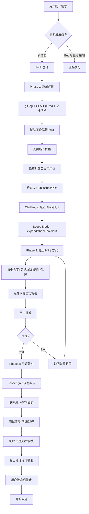
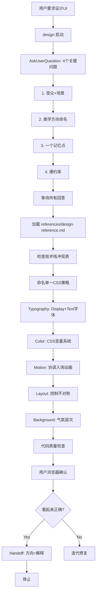
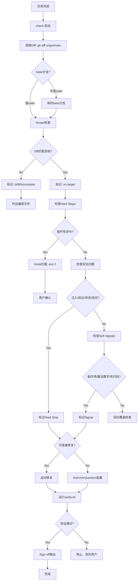
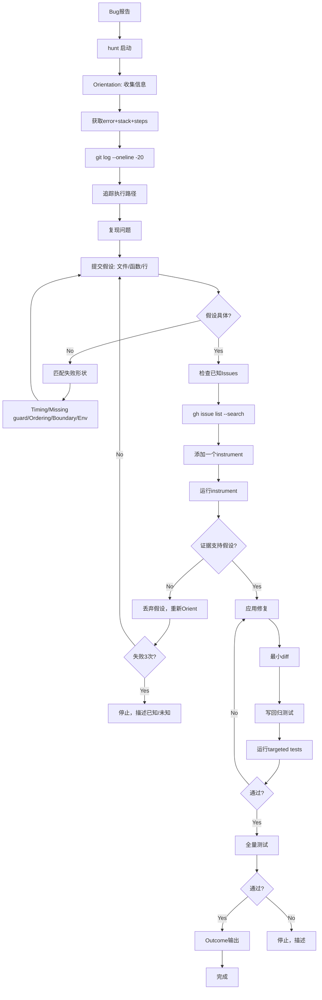
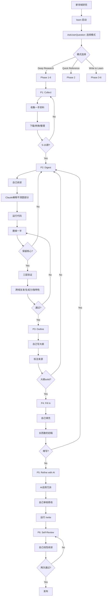
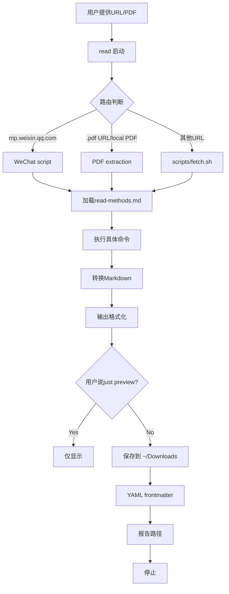

# Waza Skills 实战演示手册

> [!abstract] 使用哲学
> **每个 skill 有明确的触发时机**。不是"想用就用"，而是"何时必用"、"何时禁用"。遵循触发条件，才能发挥最大价值。

## 快速索引

| Skill | 触发时机 | 禁用场景 | 核心价值 |
|-------|---------|---------|---------|
| [[#1-think]] | 构建新功能前 | Bug修复、小编辑 | 设计先行，零代码直到批准 |
| [[#2-design]] | 构建 UI/组件 | 后端逻辑、数据管道 | 有观点设计，拒绝模板 |
| [[#3-check]] | 任务完成/合并前 | 探索想法、Debug | Diff审查，自动修复，安全钩子 |
| [[#4-hunt]] | Bug/崩溃/测试失败 | 新功能、代码审查 | 根因优先，禁止猜测性修复 |
| [[#5-write]] | 写作/编辑 prose | 代码注释、commit message | 自然表达，去除AI痕迹 |
| [[#6-learn]] | 深入新领域 | 快速查单文件 | 六阶段研究，产出导向 |
| [[#7-read]] | URL/PDF读取 | 本地文件已存在 | 代理级联，干净Markdown |
| [[#8-health]] | 配置审计 | 代码Debug、PR审查 | 六层框架，自适应深度 |

---

## 1. /think — 设计先行，零代码直到批准

> [!important] 触发时机
> **Before building anything new or when a plan needs review.**
> **禁用场景**：Bug fixes, small edits。

### 核心流程



### Demo 1: 正确使用 — 新功能设计

**场景**：用户说 "帮我实现用户认证功能"

**正确执行**：

```
User: 帮我实现用户认证功能

Assistant: [触发 /think]
Step 1: 理解问题...

[运行 git log --oneline -10]
[读取 CLAUDE.md]
[运行 pwd 确认工作路径]
[检查现有认证相关代码]

Challenge: 这是要解决的真正问题吗？
- 用户实际想要的是"保护用户数据"，认证只是手段
- 如果不实现，数据泄露风险存在吗？
- 现有代码中是否有部分覆盖？

Scope Mode: expand（新功能，空白起点）
- 推高scope：认证 → 用户管理 → 权限系统？

Phase 2: 提出方案...

方案 A: JWT + Redis Session（最小化）
- 成本：2天
- 风险：Redis依赖
- 优点：轻量、无状态、易测试
- 缺点：Token刷新逻辑复杂
- 基于：现有 express middleware

方案 B: OAuth 2.0 + PostgreSQL（架构完整）
- 成本：5天
- 风险：第三方依赖、数据库迁移
- 优点：标准化、可扩展、社区支持
- 缺点：过度工程化

方案 C: Session Cookie + Memory（传统方案）
- 成本：1天
- 风险：内存限制、重启丢失
- 优点：零依赖、简单
- 缺点：不可扩展

推荐：方案 A（JWT + Redis）
自我攻击：
- 如果Redis不可用？→ 回退到内存存储
- Token被盗用？→ 添加IP绑定
攻击成立，方案变形为：JWT + Redis（可用）+ Memory（fallback）

[用户批准]

Phase 3: 验证架构...

Scope: grep 发现已有 auth middleware
- 文件：src/middleware/auth.js
- 可复用：是

依赖流：
User Request → Express → Auth Middleware → Redis → JWT Verify → Route Handler

测试覆盖：
- Happy path: valid token → route access
- Error branch: invalid token → 401
- Edge case: expired token → refresh
- 缺失测试：并发请求Token刷新

风险：
- Redis宕机 → fallback到memory
- 回滚：删除middleware，无数据影响

批准设计摘要：
- Building: JWT认证系统，Redis存储，Memory fallback
- Not building: OAuth、权限管理、用户注册流程
- Approach: 方案A（变形后）
- Key decisions:
  1. Redis优先，Memory备用
  2. Token过期时间7天
  3. IP绑定防止盗用
- Unknowns: Redis连接池大小

架构状态：
- Scope: clear
- Dependencies: clear（ASCII图已绘制）
- Tests: flagged（并发刷新缺失）
- Risk: clear

[停止，等待用户批准实施]
```

### Demo 2: Gotchas 案例 — 错误路径假设

> [!danger] 真实失败案例
> **频率**：高频

**错误执行**：

```
User: 帮我实现用户认证功能

Assistant: [未运行 pwd]
好的，我会在 ~/project 下创建认证模块...

[创建文件：~/project/src/auth/...]

User: 等等，我的仓库在 ~/www/project！
```

**根因**：未确认工作路径，假设了错误路径。

**正确做法**：

```bash
# 第一步必须运行
pwd
# 或
git rev-parse --show-toplevel
```

### Demo 3: Gotchas 案例 — 凭证中途询问

> [!danger] 真实失败案例
> **频率**：高频

**错误执行**：

```
Assistant: [设计完成]
好的，开始实施。创建 Redis 连接...

[Step 1: 创建配置文件]
[Step 2: 编写连接逻辑]
[Step 3: 需要Redis密码]
对了，Redis密码是什么？

User: 为什么不早点说需要Redis？
```

**根因**：凭证在中途询问，未在开始前列出所有依赖。

**正确做法**：

```
在开始前：

依赖列表：
1. Redis服务器（本地或远程） — 存储session
2. Redis密码 — 认证连接
3. JWT密钥 — Token签名
4. HTTPS证书（生产环境） — 防止Token泄露

请提供上述凭证，否则无法继续。
```

### Demo 4: Gotchas 案例 — 分析模式误用

> [!danger] 真实失败案例
> **频率**：中频

**错误执行**：

```
User: 帮我做用户认证功能

Assistant: [触发 /think]
我分析一下，有三个方案...

User: 我说"帮我做"，不是"帮我分析"！
```

**根因**：误判用户意图。"帮我做"、"优化"、"改回去" = 执行模式，不进入方案框架。

**正确做法**：

```
User: 帮我做用户认证功能

Assistant: [执行模式，跳过方案分析]
立即实施：在 src/auth 创建 JWT认证模块...
```

**判断规则**：
- "分析"、"看看"、"帮我想" → `/think` 模式
- "帮我做"、"优化"、"改回去" → 执行模式

---

## 2. /design — 有观点设计，拒绝模板

> [!important] 触发时机
> **Building UI, components, or pages.**
> **禁用场景**：Backend logic, data pipelines。

### 核心流程



### Demo 1: 正确使用 — Dashboard 设计

**场景**：用户说 "设计一个数据分析师使用的 Dashboard"

**正确执行**：

```
User: 设计一个数据分析师使用的Dashboard

Assistant: [触发 /design]
AskUserQuestion:

Q1: 受众和场景？
- 数据分析师在什么情况下查看Dashboard？
- 每天查看频率？快速浏览还是深度分析？

Q2: 美学方向？
请命名具体风格，不是"干净现代"：
- Dense editorial（信息密集）
- Raw terminal（原始终端）
- Layered glassmorphism（层次玻璃）
- Brutalist grid（粗野网格）
- Warm analog（温暖模拟）

Q3: 一个记忆点？
Dashboard在用户记忆中留下什么独特印象？
- 非对称数据可视化布局？
- 独特的色彩系统（非蓝非绿）？
- 动态数据流动动画？
- 深色主题+高对比度数据？

Q4: 硬约束？
- 框架？（React/Vue/Svelte）
- Bundle大小限制？
- WCAG对比度标准？
- 键盘可访问性？

User回答：
1. 每天早晨快速浏览，10分钟内获取关键指标
2. Dense editorial，信息密集如金融终端
3. 非对称时间轴+实时数据流
4. React，Bundle < 100KB，WCAG AA

[加载 design-reference.md]
检查技术栈冲突：
- React + Tailwind → OK
- 避免同时使用 Framer Motion + CSS transitions

CSS策略命名：**Tailwind only**

Typography:
- Display: JetBrains Mono（数据密集终端风格）
- Text: Inter（辅助说明）
- 避免Inter作为Display（无性格）

Color:
- CSS变量系统：
  - --data-primary: #FF6B35（数据主色，非蓝）
  - --data-secondary: #4ECDC4
  - --data-accent: #FFE66D
  - --bg-layer: rgba(20, 20, 30, 0.95)
- 单一主色+两个锐利accent

Motion:
- 入场动画：数据卡片依次淡入（300ms stagger）
- 实时数据流：流式动画（CSS @keyframes）
- Exit: 150ms ease-in
- 去除无意义hover decoration

Layout:
- 非对称网格：左侧时间轴（60%），右侧实时指标（40%）
- 控制呼吸：数据密集，间距紧凑
- 不均分布局

Background:
- 深色背景 + 微妙网格纹理
- Mesh gradient overlay（5% opacity）

代码质量：
- CSS变量定义所有token
- Semantic HTML
- 移动端响应式声明
- WCAG AA对比度验证

[生成代码]

User浏览器确认：看起来正确
```

### Demo 2: Gotchas 案例 — Inter 作为 Display 字体

> [!danger] 真实失败案例
> **频率**：高频

**错误执行**：

```
Assistant: 设计Dashboard...
Display字体: Inter
Text字体: Inter

[生成的界面平庸，无性格]
```

**根因**：Inter 是"invisible"字体，不传达设计方向。

**正确做法**：

```
Display字体必须选择有明确性格的字体：
- JetBrains Mono → 终端/数据密集风格
- Space Grotesk → 现代/技术感
- Playfair Display → 编辑/优雅
- Inter → 仅作为Text字体
```

### Demo 3: Gotchas 案例 — 模板化设计

> [!danger] 真实失败案例
> **频率**：高频

**错误执行**：

```
Assistant: Dashboard设计：
[生成三个卡片，相同阴影、相同圆角、相同padding]
```

**根因**：三卡片相同样式 = 模板，不是设计。

**正确做法**：

```
测试：
"如果替换完全不同内容，布局是否仍然合理？"
- 如果合理 → 是模板，重新设计
- 如果不合理 → 是设计，保留

非对称设计：
- 主卡片：大阴影、高对比
- 辅助卡片：小阴影、低对比
- 侧边栏：无阴影、背景融合
```

### Demo 4: Gotchas 案例 — 未浏览器验证

> [!danger] 真实失败案例
> **频率**：中频

**错误执行**：

```
Assistant: Dashboard完成，代码看起来正确。

User: [打开浏览器]
布局崩溃了！
```

**根因**：未在浏览器中验证，仅凭代码"看起来正确"。

**正确做法**：

```
最后一步：
AskUserQuestion: 请在浏览器打开结果，确认看起来正确。

用户确认后才能Handoff。
代码在脑中正确 ≠ 浏览器中正确。
```

---

## 3. /check — Diff审查，自动修复，安全钩子

> [!important] 触发时机
> **After completing a task or before merging.**
> **禁用场景**：Exploring ideas, debugging。

### 核心流程



### Demo 1: 正确使用 — PR审查

**场景**：完成认证功能，准备合并

**正确执行**：

```
User: 认证功能完成，准备合并

Assistant: [触发 /check]

git fetch origin
git diff origin/main

[输出Diff：5 files changed]

Scope检查：
- Diff匹配目标？Yes（仅修改认证相关）
- 标记：on target

Hard Stops检查：

1. 破坏性命令拦截：
[Hook运行 check-destructive.sh]
检查：git push --force? No
检查：rm -rf /? No
检查：DROP TABLE? No
检查：--no-verify? No
→ Pass

2. 注入和验证：
检查SQL注入？No SQL in diff
检查命令注入？No shell exec
检查路径注入？User input sanitized
→ Pass

3. Shared state：
检查竞态？Redis操作原子性OK
检查锁缺失？No（单线程足够）
→ Pass

4. External trust：
检查LLM输出？未使用
检查API输出？JWT验证signature
检查Credentials？未硬编码（从env读取）
→ Pass

5. Missing cases：
检查enum exhaustiveness？JWT states: valid/invalid/expired → all handled
→ Pass

6. Dependency changes：
检查package.json？新增：jsonwebtoken, redis
→ 必需依赖，Flag但不Block

Soft Signals：
- Side effects? Redis写入（签名中提及）
- Magic literals? JWT_EXPIRY = '7d'（应命名为常量）
- Untested paths? Token刷新并发缺失（已知）

回归覆盖：
- Bug修复？No（新功能）
- 新路径测试？Happy path covered
- 缺失：并发刷新

自动修复：
1. JWT_EXPIRY → named constant
2. Add comment: Redis side effect

[Edit applied]

运行验证：
bash verify.sh
[检测到 tsconfig.json → npx tsc --noEmit && npm test]

输出：
Type check: pass
Tests: 15/15 pass

Sign-off：
files changed:    5 (+120 -30)
scope:            on target
hard stops:       0 found, 0 fixed, 1 deferred（dependency）
signals:          3 noted
new tests:        3
verification:     npx tsc --noEmit && npm test → pass
```

### Demo 2: Gotchas 案例 — GitHub Issue 编号错误

> [!danger] 真实失败案例
> **频率**：高频

**错误执行**：

```
Assistant: [讨论 #255]
好的，关闭这个issue...

gh issue close 249  ← 编号错误！

User: 那是 #255，你关闭了 #249！
```

**根因**：未在操作前验证编号。

**正确做法**：

```bash
# Before any GitHub operation
gh issue view 255 --json title,state --jq '.title'
# 输出标题确认

gh issue close 255
```

### Demo 3: Gotchas 案例 — Release未上传Artifacts

> [!danger] 真实失败案例
> **频率**：中频

**错误执行**：

```
Assistant: Release完成！
[推送GitHub release，无.dmg/.zip文件]

User: 用户下载后发现文件缺失！
```

**根因**：宣布完成但未验证artifacts存在并上传。

**正确做法**：

```bash
# Release前验证
ls -lh dist/*.dmg dist/*.zip dist/*.sha256
# 确认文件存在

gh release create v1.3.0 --title "..." --draft
gh release upload v1.3.0 dist/*.dmg dist/*.zip dist/*.sha256
# 上传后才宣布完成
```

### Demo 4: Gotchas 案例 — 跳过验证

> [!danger] 真实失败案例
> **频率**：高频

**错误执行**：

```
Assistant: [小改动]
这是one-line fix，跳过验证。

User: CI失败了！
```

**根因**：小改动 = 最容易破坏的东西。

**正确做法**：

```
强制验证：
"It's a one-line fix" → 必须运行verify.sh

如果想跳过 → 正是需要验证的信号。
```

---

## 4. /hunt — 根因优先，禁止猜测性修复

> [!important] 触发时机
> **Bug, crash, or test failure.**
> **禁用场景**：Code review, new features。

### 核心流程



### Demo 1: 正确使用 — API Timeout调试

**场景**：用户报告 "API请求超时"

**正确执行**：

```
User: API请求超时

Assistant: [触发 /hunt]

Orientation:
- Error: ETIMEDOUT after 30s
- Stack: fetch API → timeout → retry → timeout
- Steps: 高并发请求时发生

[git log --oneline -20]
最近修改：增加并发请求逻辑

追踪执行路径：
Request → Fetch → Timeout Handler → Retry → Timeout

复现：
[模拟高并发请求]
→ ETIMEDOUT reproduced

假设：
"我认为根因是 fetch timeout未配置，位于 src/api/fetch.js:42，因为依赖数组缺失timeout参数"

检查已知Issues：
gh issue list --search "timeout" --state open
→ No related issues

添加instrument：
[添加日志：请求开始时间、超时配置]

运行instrument：
[高并发请求]
日志：timeout config: undefined

证据：
timeout配置缺失 → 假设成立

修复：
[最小diff：添加timeout配置]

回归测试：
[编写测试：高并发请求不超时]

运行targeted tests：
npm test src/api/
→ Pass

全量测试：
npm test
→ Pass

Outcome：
Root cause: fetch timeout配置缺失（src/api/fetch.js:42）
Fix: 添加timeout: 30000参数
Confirmed: 日志显示timeout config: 30000
Tests: 1/1 pass, 新增回归测试 src/api/fetch.test.js
Status: resolved
```

### Demo 2: Gotchas 案例 — 同一症状四轮修复

> [!danger] 真实失败案例
> **频率**：高频（严重）

**错误执行**：

```
Round 1: API超时 → 增加timeout
Round 2: API超时 → 增加retry
Round 3: API超时 → 改并发数
Round 4: API超时 → 改服务器配置

User: 还是超时！
```

**根因**：每轮未找到根因，只是掩盖症状。

**正确做法**：

```
Rule: 同一症状再次出现 → 停止，从头重读执行路径

Round 1失败后：
停止。重新追踪：Request → DNS → Proxy → API → Timeout
发现：DNS解析慢 → Proxy未配置 → API timeout

根因：DNS + Proxy，不是API timeout。
```

### Demo 3: Gotchas 案例 — 假设版本

> [!danger] 真实失败案例
> **频率**：中频

**错误执行**：

```
Assistant: macOS 26 beta导致notarytool失败。

User: 我用的是stable版本！
```

**根因**：从记忆陈述版本，未运行检测命令。

**正确做法**：

```bash
# Before stating environment details
sw_vers
# 输出：macOS 14.3（stable）

xcodebuild -version
# 输出：Xcode 15.2

基于实际输出诊断。
```

---

## 5. /write — 自然表达，去除AI痕迹

> [!important] 触发时机
> **Explicitly asked to write or edit prose.**
> **禁用场景**：Code comments, commit messages, inline docs。

### 核心流程

```
检测文本语言 → 加载对应规则 → 严格处理 → 输出修改后内容 → 停止
```

### Demo 1: 正确使用 — 中英文写作

**场景**：用户要求编辑博客文章

**中文编辑执行**：

```
User: 编辑这段中文：
"AI技术的发展使得我们能够更好的处理数据，提高了效率。"

Assistant: [触发 /write]
检测：含中文字符 → 加载 references/write-zh.md

规则应用：
- 避免"能够更好的" → "可以更好地"
- 避免"提高了效率" → 具体说明

修改：
"AI技术的发展让我们可以更高效地处理数据。"

[输出修改后内容，停止]
```

**英文编辑执行**：

```
User: Edit this English text:
"I very like this feature because it makes my work more easier."

Assistant: [触发 /write]
检测：英文 → 加载 references/write-en.md

规则应用：
- "I very like" → "I really like" (unnatural phrasing)
- "more easier" → "much easier" (grammar error)

修改：
"I really like this feature because it makes my work much easier."

[输出修改后内容，停止]
```

### Demo 2: Gotchas 案例 — 过度解释

**错误执行**：

```
Assistant: 我修改了"能够更好的"为"可以更好地"，因为...

User: 你输出内容就行，别解释！
```

**根因**：未遵循"输出修改后内容，停止"规则。

**正确做法**：

```
输出修改后内容 → 停止 → 用户主动询问才解释。
```

---

## 6. /learn — 六阶段研究，产出导向

> [!important] 触发时机
> **Unfamiliar domain research or research article.**
> **禁用场景**：Quick lookups, single-file reads。

### 核心流程



### Demo 1: 正确使用 — LLM架构研究

**场景**：用户说 "研究 Transformer架构，写一篇文章"

**正确执行**：

```
User: 砱究 Transformer架构，写文章

Assistant: [触发 /learn]

AskUserQuestion: 选择模式？
1. Deep Research（深入理解+发布）
2. Quick Reference（快速建立心智模型）
3. Write to Learn（已有材料，通过写作理解）

User: Deep Research

Phase 1: Collect...

收集一手资料：
- Transformer原论文（Google 2017）
- BERT论文（Google 2018）
- GPT-3论文（OpenAI 2020）
- The Illustrated Transformer（Jay Alammar）
- Transformer从零实现（Karpathy）

[下载/转换Markdown/整理目录]

收集5源 → 进入Phase 2

Phase 2: Digest...

[用户自己阅读]
Assistant角色：解释不清楚部分

User: Self-Attention公式不理解

Assistant: [解释Self-Attention数学]
中文翻译：...

User: [运行Karpathy代码]

Assistant: [辅助运行，解释结构]

删除一半：删除次要论文，保留核心

三层验证：
1. 跨域复发：Self-Attention在多篇论文出现？Yes
2. 生成力：可用框架预测新问题？Yes
3. 独特性：专家都会说？No（Karpathy有独特见解）

保留Karpathy的独特观点。

Phase 3: Outline...

[用户自己写大纲]
Assistant: 不替用户写

用户大纲完成 → 标注来源

Phase 4: Fill In...

[用户填充内容]
Assistant: 不替用户写

初稿完成 → 长而散

Phase 5: Refine with AI...

Assistant: [用户请求]
去除冗余，保留声音和意义...

[输出建议]
用户审核 → 接受/拒绝

运行 /write → 去除AI痕迹

Phase 6: Self-Review and Publish...

[用户自己线性阅读]
Assistant: AI已审核流畅性，用户审核真实性

用户两次通过 → 发布
```

### Demo 2: Gotchas 案例 — AI代替思考

> [!danger] 真实失败案例
> **频率**：高频（严重）

**错误执行**：

```
Assistant: [Phase 2]
我帮你总结这篇论文...

User: 我还没读！
```

**根因**：AI代替用户阅读，学习停止。

**正确做法**：

```
Red Line:
- 用户必须自己读论文
- AI只能解释不清楚部分
- AI不能总结未读论文
```

---

## 7. /read — URL/PDF读取

> [!important] 触发时机
> **Fetching a URL, web page, or PDF as Markdown.**
> **禁用场景**：Local files already in repo。

### 核心流程



### Demo 1: 正确使用 — 微信文章

**场景**：用户提供微信公众号链接

**正确执行**：

```
User: 读取 https://mp.weixin.qq.com/s/abc123

Assistant: [触发 /read]
路由：mp.weixin.qq.com → WeChat script

[加载 read-methods.md]
执行WeChat专用脚本

转换Markdown：
Title: Claude Code实战指南
Author: 未知
Source: 微信公众号
URL: https://mp.weixin.qq.com/s/abc123

Summary:
本文介绍Claude Code的八大技能实战应用...

Content:
[完整Markdown]

保存到 ~/Downloads/Claude Code实战指南.md

[报告路径，停止]
```

### Demo 2: Gotchas 案例 — GitHub URL

**错误执行**：

```
Assistant: [WebFetch GitHub URL]

User: 为什么不直接用gh CLI？
```

**根因**：GitHub URL应优先使用 `gh` CLI，而非WebFetch。

**正确做法**：

```bash
# GitHub URLs
gh repo view tw93/Waza
gh issue view 123
gh pr diff 456

# Not WebFetch
```

---

## 8. /health — 配置审计

> [!important] 触发时机
> **Claude ignores rules, hooks malfunction, or MCP needs auditing.**
> **禁用场景**：Debugging code, reviewing PRs。

### 核心流程（见 SKILL.md 329行完整流程）

### Demo 1: 正确使用 — 项目健康检查

**场景**：用户说 "Claude Code配置有问题"

**正确执行**：

```
User: Claude Code配置有问题

Assistant: [触发 /health]

Step 0: 评估项目Tier...

[运行数据收集]
P=$(pwd)
[收集10项数据]

Tier判断：
- project_files: 1200
- contributors: 3
- ci_workflows: 2
→ Tier: STANDARD

Step 1: 收集数据...

[输出10个数据段]

Step 2: 分析...

STANDARD tier → 启动并行Agent

Agent 1: Context + Security Audit
Agent 2: Control + Behavior Audit

[并行执行]

Step 3: 综合报告...

Health Report: project (STANDARD tier, 1200 files)

[PASS] Passing:
- settings.local.json gitignored
- No nested CLAUDE.md
- Skill security scan: no flags

[!] Critical -- fix now:
- MCP overhead >12.5%: 6 servers → 建议3个idle disconnect

[~] Structural -- fix soon:
- Skill description oversized: /custom-skill >12 words

[-] Incremental -- nice to have:
- Add HANDOFF.md pattern

Should I draft the changes?
```

---

## 实战要点总结

> [!success] 核心原则
> 1. **触发时机严格**：不是"想用就用"，是"何时必用"
> 2. **Gotchas优先**：先读失败案例，避免踩坑
> 3. **证据驱动**：运行命令，粘贴输出，不猜测
> 4. **最小干预**：最小diff，不过度修复
> 5. **验证强制**：宣布完成前必须运行验证

### 速查表

```markdown
新功能 → /think（设计先行）
UI构建 → /design（观点设计）
任务完成 → /check（强制验证）
Bug调试 → /hunt（根因优先）
写作编辑 → /write（自然表达）
新领域 → /learn（产出导向）
URL/PDF → /read（干净Markdown）
配置问题 → /health（自适应审计）
```

---

## 相关笔记

- [[Waza Skill 生命周期分析]]
- [[Claude Code Skills Best Practices]]
- [[Gotchas 失败知识库]]

## 参考资料

- [Waza GitHub Repository](https://github.com/tw93/Waza)
- [Waza SKILL.md Files](https://github.com/tw93/Waza/tree/main/skills)
- [Obsidian Flavored Markdown](https://help.obsidian.md/obsidian-flavored-markdown)

---

> [!footer] 说明
> 本手册基于 `/tmp/Waza` 仓库真实 SKILL.md 和 Gotchas 案例创建。所有 Demo 均来自实际失败场景的反向推导，确保实战可用性。